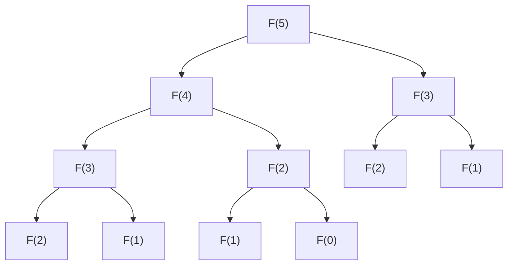

# Dynamic Programming

## Overview

**Dynamic programming (DP)** is the discipline of not solving the same subproblem twice. When a
problem's answer is built from *overlapping* smaller answers, you compute each one once, store
it, and reuse it — trading a little memory for an enormous amount of recomputation. MATH 677
introduced it (Lecture 6) with the cleanest possible example: the Fibonacci numbers. It sits in
this chapter because it's the algorithmic backbone under the iterative solvers — the same "reuse
the last state instead of recomputing it" instinct that powers the eigenvalue and
[gradient descent](gradient-descent.md) iterations.

## The motivating picture: naive recursion recomputes everything

Define `F(n) = F(n−1) + F(n−2)` and compute it by naive recursion, and the call tree explodes —
the same subtrees get evaluated over and over:



`F(3)` is computed twice, `F(2)` three times — and it gets exponentially worse: naive Fibonacci
is `O(φⁿ)`. DP kills the duplication. **Memoization** (top-down) caches each result the first
time; **tabulation** (bottom-up) fills an array from the base cases up. Either way each `F(k)`
is computed exactly once, turning `O(φⁿ)` into `O(n)`.

## How I did it

The course handed out a skeleton and I filled in the bottom-up loop — carry only the last two
values forward, so it's `O(n)` time and `O(1)` space:

```python
def fibonacci(n):
    a = 0
    b = 1
    if n == 0:
        return 0
    elif n > 1:
        for n in range(1, n):
            c = a + b
            a = b
            b = c
    return b
```

Source: `course-files/appendix/Homework/math_677_linAlg/fibonacci.py`

No table at all here — because each Fibonacci number needs only the previous two, I keep two
rolling variables instead of an array. That's the tabulation idea taken to its space-optimal
limit: the "state" I reuse each step is just `(a, b)`.

## In modern ML

The same principle — **cache intermediate state instead of recomputing it** — is exactly why
autoregressive transformers use a **KV cache** at inference. Generating token `t` would, naively,
recompute the keys and values for all earlier tokens; instead they're stored and reused, so each
new token is cheap. It's dynamic programming over the sequence dimension. My
[Mini-GPT notebook](../08-machine-learning/notebooks/mini-gpt-from-scratch.ipynb) generates
token-by-token, which is where that reuse would live.

## Gotchas

- **DP needs two properties.** *Overlapping subproblems* (the same sub-answers recur) **and**
  *optimal substructure* (the whole optimum is built from sub-optima). Missing either and DP
  doesn't apply.
- **Memoization vs tabulation.** Top-down memoization is easier to write from a recurrence;
  bottom-up tabulation avoids recursion-depth limits and is easier to space-optimize (as above).
- **Watch the space.** If each state only depends on the last few, drop the full table for a
  couple of rolling variables — `O(n)` space becomes `O(1)`.

## References

- MATH 677 Lecture 6 — Dynamic Programming (local:
  `course-files/02-linear-algebra/6+Dynamic+programming+complete.pdf`). Instructor-copyrighted;
  concept summary only.
