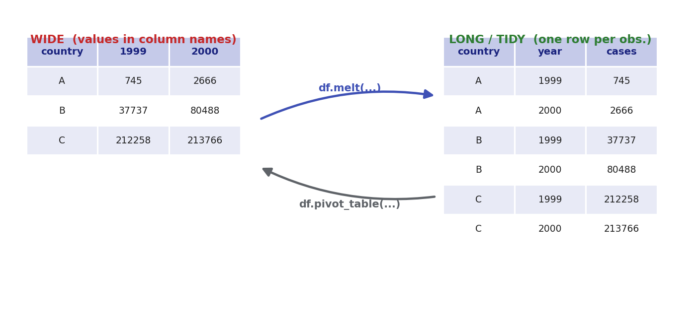

# Tidy Data & Reshaping

## Summary

Most wrangling is moving a messy table toward one specific shape. **Tidy data** (the term is
Hadley Wickham's, and the DS 250 lesson this page is built from ports his `tidyr` teaching
examples to pandas) has three rules:

1. Each **variable** is a column.
2. Each **observation** is a row.
3. Each **value** is a single cell.

Once you can spot which rule a table breaks, the fix is one of a small set of reshape verbs.
This page walks the four I use constantly — `melt`, `pivot_table`, splitting a column, and
uniting columns — on the small `table1`–`table5` teaching tables, where you can eyeball every
row.

## Wide vs. long, and the two verbs between them

The most common mess is a table that's too **wide**: values crammed into the *column names*.
A table with a `1999` column and a `2000` column is really storing a `year` variable in its
header. Tidying it means going **long** — pulling those headers down into a real column with
`melt`. The reverse, `pivot_table`, spreads a long table back out to wide.



### `melt`: wide → long

`table4a` has one column per year — untidy. `melt` collapses the year columns into a `year`
variable and a `cases` value, keeping `country` as the identifier:

```python
table4a.melt(['country'], var_name="year", value_name="cases")
```

The list argument (`['country']`) is the set of **id columns** to hold fixed; everything else
gets melted down. Keep more than one column fixed by listing them all:

```python
t4a.melt(['country', 'population'], var_name="year", value_name="cases")
```

Source: `course-files/04-data-wrangling/data_cleaning_lesson.ipynb` (my own-typed DS 250
"Week 10" tidy-data lesson; mirrors `DS_250/Project5/week11_class/week10-lesson2.ipynb`).

### `pivot_table`: long → wide

`table2` has the opposite problem: a single `type` column holds what are really two different
variables (`cases` and `population`) stacked as key/value rows, so each observation is spread
across *two* rows. `pivot_table` fans that `type` column back out into columns:

```python
table2.pivot_table(
    index=['country', 'year'],   # what stays as row identity
    columns='type',              # the column whose values become new columns
    values='count',              # what fills the cells
).reset_index()
```

Source: same lesson notebook. The `.reset_index()` matters — `pivot_table` puts the index
columns into the DataFrame index, and resetting turns them back into ordinary columns.

## Splitting one column into several

A cell holding more than one value breaks tidy rule 3. `table3` stores `rate` as the string
`"745/19987071"` — two variables, `cases` and `population`, jammed into one cell. The
vectorized fix is `.str.split(expand=True)`:

```python
new_columns = (table3.rate
    .str.split("/", expand=True)
    .rename(columns={0: "cases", 1: "population"}))

new_table = pd.concat([table3.drop(columns='rate'), new_columns], axis=1)
```

`expand=True` returns a DataFrame (one column per split piece) instead of a column of lists,
and `pd.concat(..., axis=1)` glues the new columns back onto the original frame after dropping
the raw `rate`. Source: same lesson notebook.

The same move shows up in real assignment data all the time. In the DS 250 coding challenge,
an `age` column stored ranges like `"10-19"` as strings; splitting on the dash gives a usable
minimum and maximum:

```python
new = people["age"].str.split("-", n=1, expand=True)
people["min_age"] = new[0]
people["max_age"] = new[1]
people.drop(columns=["age"], inplace=True)
```

Source: `~/Projects/school/byui-undergrad/DS_250/Coding_challenge/ds250_challenge.qmd`
(my own, DS 250; mirrored at `course-files/04-data-wrangling/ds250-final-chal-wrangling.qmd`).
The `n=1` caps the number of splits — useful when only the first delimiter should split and
later ones are part of the value.

> **A note on `pd.concat`.** The `concat` above is the workhorse for *stacking* frames —
> `axis=1` to glue columns side by side (as here), `axis=0` to stack rows. It's not a
> key-based join, though. When you need to combine tables on a shared **key** (one table's
> `id` matched to another's), that's `pd.merge` / `.join`, which follow the same inner/left/
> right/outer semantics as SQL joins — covered in the
> [SQL & Databases chapter](../07-sql-and-databases/sql-essentials.md#joins).

## Uniting several columns into one

The reverse of splitting: `table5` stores a year as a `century` column (`"19"`) and a `year`
column (`"99"`) that should be one value. Join them row-wise with `.agg` and a string join:

```python
table5.assign(new=table5[['century', 'year']].agg("_".join, axis=1))
```

`axis=1` runs the join *across columns within each row*. One catch that bit me: this only
works if both columns are strings. `table5` was read with `dtype='object'` on purpose —
`"19" + "99"` concatenates to `"1999"`, but `19 + 99` would *add* to `118`. Source: same
lesson notebook.

## Notebook

- [Tidy Data: melt / pivot / split / unite](notebooks/tidy-data-lesson.ipynb) — every verb
  above run on the `table1`–`table5` teaching tables (loaded live from the public
  byuidatascience data repo), plus the `.str` string-method demos and the `mpg`/`presidential`
  charting examples from the same lesson. Re-run it with
  `jupyter lab docs/04-data-wrangling/notebooks/`.

## Gotchas

- **`melt` needs to know the id columns.** Anything you *don't* list as an id gets melted. If
  a column you meant to keep fixed disappears into the `variable`/`value` pair, you left it
  out of the id list.
- **`pivot_table` aggregates by default.** If more than one row maps to the same
  index/column cell, `pivot_table` silently averages them (its default `aggfunc='mean'`). Use
  `pivot` instead when you expect a unique mapping and want an error on duplicates rather than
  a silent mean.
- **`.str.split()` without `expand=True` gives you a column of lists.** That's rarely what you
  want and it breaks the next step; remember `expand=True` to get real columns.
- **Uniting numeric columns adds instead of concatenating.** `"19" + "99" == "1999"` but
  `19 + 99 == 118`. Cast to `str` (or read as `object`) before a string-join unite.
- **`pivot_table` buries your keys in the index.** Chain `.reset_index()` unless you actually
  want a MultiIndex — forgetting it is the usual reason a "why is `country` not a column
  anymore?" surprise happens.
