# ggplot2 Fundamentals

## Overview

ggplot2 is R's most powerful and popular visualization package, implementing the Grammar of Graphics framework. Created by Hadley Wickham, ggplot2 provides a consistent, layered approach to building visualizations that separates data, aesthetic mappings, and geometric representations.

## The Grammar of Graphics in ggplot2

Every ggplot2 visualization is built from these components:

1. **Data**: The dataset to visualize
2. **Aesthetics (aes)**: Mappings from data to visual properties
3. **Geometries (geom)**: The visual elements that represent data
4. **Scales**: How data values map to aesthetic values
5. **Coordinate systems**: How positions are interpreted
6. **Facets**: Splitting data into subplots
7. **Themes**: Non-data visual elements

## Basic Syntax

```r
library(ggplot2)

# Basic structure
ggplot(data = <DATA>) +
  <GEOM_FUNCTION>(mapping = aes(<MAPPINGS>))
```

### First Plot

```r
library(ggplot2)

# Using built-in mpg dataset
ggplot(data = mpg) +
  geom_point(mapping = aes(x = displ, y = hwy))
```

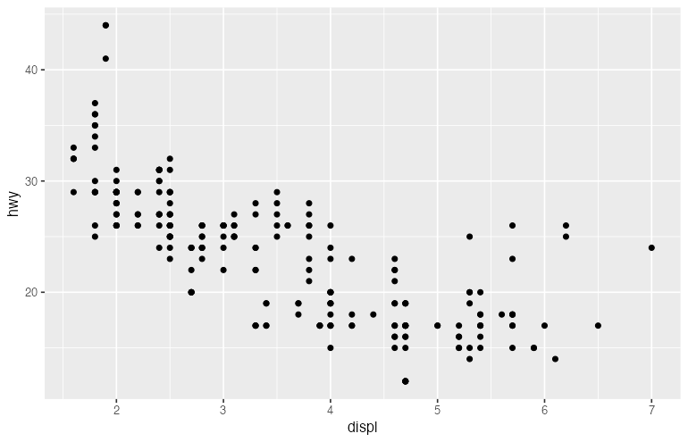

**Visual description**: A scatter plot showing the relationship between engine displacement (x-axis) and highway miles per gallon (y-axis) for various car models.

## Aesthetic Mappings

Aesthetics connect data variables to visual properties:

```r
library(ggplot2)

# Map color to a variable
ggplot(data = mpg) +
  geom_point(mapping = aes(x = displ, y = hwy, color = class))

# Map size to a variable
ggplot(data = mpg) +
  geom_point(mapping = aes(x = displ, y = hwy, size = cyl))

# Map shape to a variable
ggplot(data = mpg) +
  geom_point(mapping = aes(x = displ, y = hwy, shape = drv))

# Map transparency (alpha) to a variable
ggplot(data = mpg) +
  geom_point(mapping = aes(x = displ, y = hwy, alpha = cyl))

# Multiple aesthetics
ggplot(data = mpg) +
  geom_point(mapping = aes(x = displ, y = hwy, color = class, size = cyl))
```

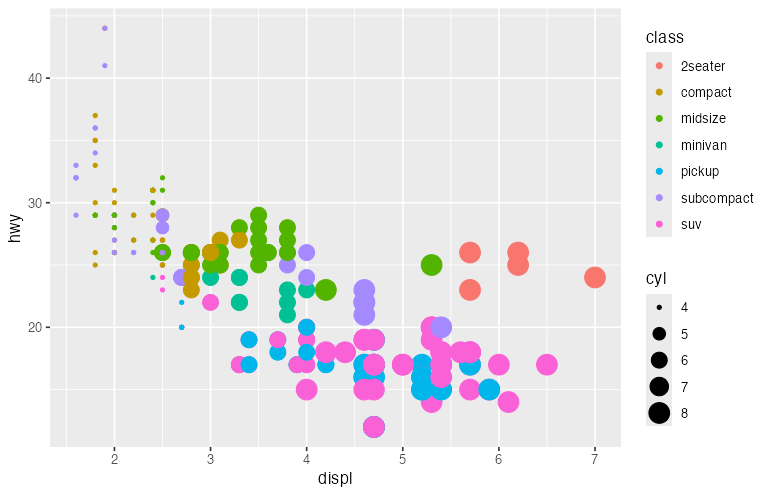

### Setting vs Mapping Aesthetics

```r
library(ggplot2)

# Mapping: inside aes() - connects to data
ggplot(data = mpg) +
  geom_point(mapping = aes(x = displ, y = hwy, color = class))

# Setting: outside aes() - fixed value
ggplot(data = mpg) +
  geom_point(mapping = aes(x = displ, y = hwy), color = "blue", size = 3)
```

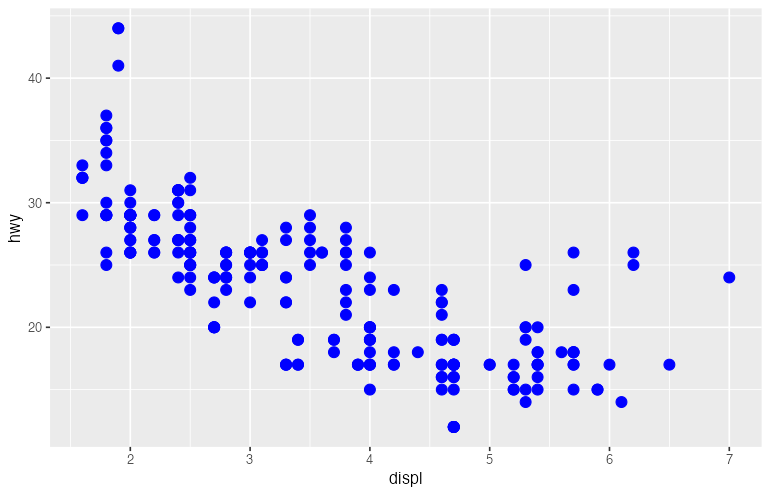

## Geometric Objects (Geoms)

### Points: `geom_point()`

```r
library(ggplot2)

ggplot(data = mpg, aes(x = displ, y = hwy)) +
  geom_point(aes(color = class), size = 3, alpha = 0.7)
```

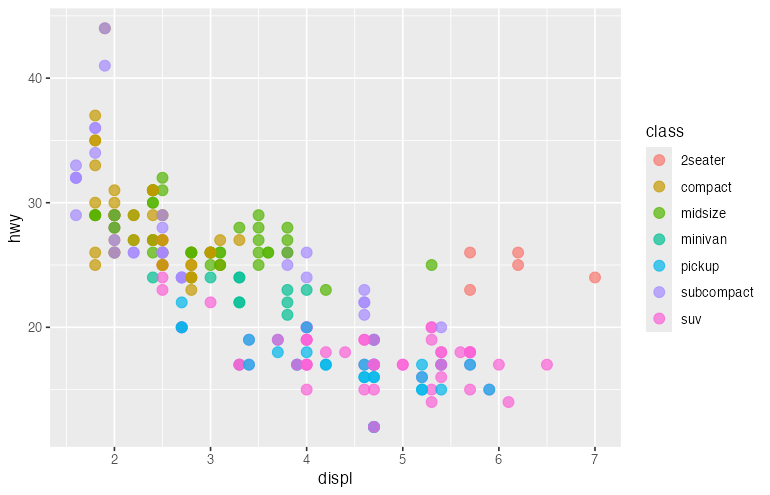

### Lines: `geom_line()` and `geom_path()`

```r
library(ggplot2)

# Time series data
economics_subset <- economics[economics$date >= "2000-01-01", ]

# geom_line connects points in order of x
ggplot(data = economics_subset, aes(x = date, y = unemploy)) +
  geom_line(color = "steelblue", size = 1)

# Multiple lines with color mapping
library(tidyr)
econ_long <- economics %>%
  pivot_longer(cols = c(psavert, uempmed), names_to = "metric", values_to = "value")

ggplot(econ_long, aes(x = date, y = value, color = metric)) +
  geom_line(size = 1)
```

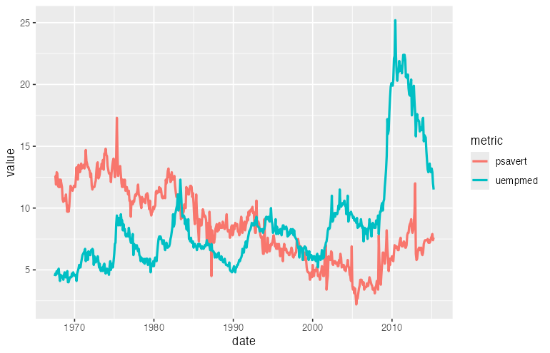

### Smooth Lines: `geom_smooth()`

```r
library(ggplot2)

# Add trend line
ggplot(data = mpg, aes(x = displ, y = hwy)) +
  geom_point() +
  geom_smooth()  # Default: loess for n < 1000, gam for larger

# Linear regression line
ggplot(data = mpg, aes(x = displ, y = hwy)) +
  geom_point() +
  geom_smooth(method = "lm", se = TRUE)

# Separate smooths by group
ggplot(data = mpg, aes(x = displ, y = hwy, color = drv)) +
  geom_point() +
  geom_smooth(method = "lm")
```

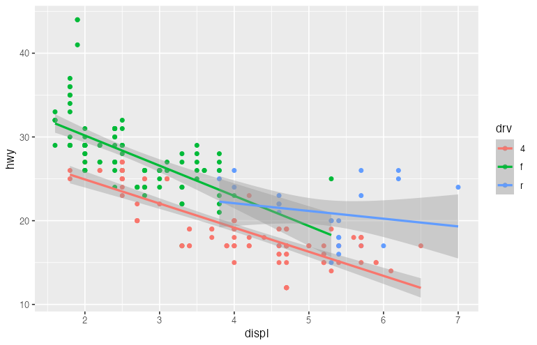

### Bars: `geom_bar()` and `geom_col()`

```r
library(ggplot2)

# geom_bar: counts occurrences (stat = "count")
ggplot(data = mpg) +
  geom_bar(mapping = aes(x = class))

# geom_col: uses values directly (stat = "identity")
# Requires pre-summarized data
library(dplyr)
mpg_summary <- mpg %>%
  group_by(class) %>%
  summarize(avg_hwy = mean(hwy))

ggplot(data = mpg_summary) +
  geom_col(mapping = aes(x = class, y = avg_hwy))

# Stacked bars
ggplot(data = mpg) +
  geom_bar(mapping = aes(x = class, fill = drv))

# Dodged (grouped) bars
ggplot(data = mpg) +
  geom_bar(mapping = aes(x = class, fill = drv), position = "dodge")

# Filled bars (proportions)
ggplot(data = mpg) +
  geom_bar(mapping = aes(x = class, fill = drv), position = "fill")
```

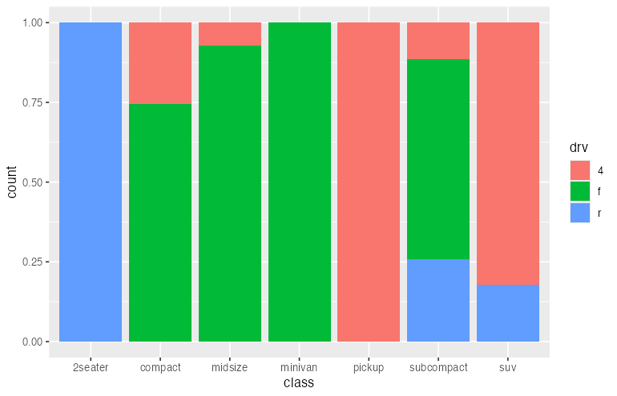

### Histograms: `geom_histogram()`

```r
library(ggplot2)

# Basic histogram
ggplot(data = mpg, aes(x = hwy)) +
  geom_histogram(bins = 30, fill = "steelblue", color = "white")

# With density curve overlay
ggplot(data = mpg, aes(x = hwy)) +
  geom_histogram(aes(y = ..density..), bins = 30, fill = "steelblue", color = "white") +
  geom_density(color = "red", size = 1)

# Faceted histograms
ggplot(data = mpg, aes(x = hwy, fill = drv)) +
  geom_histogram(bins = 20, alpha = 0.7, position = "identity")
```

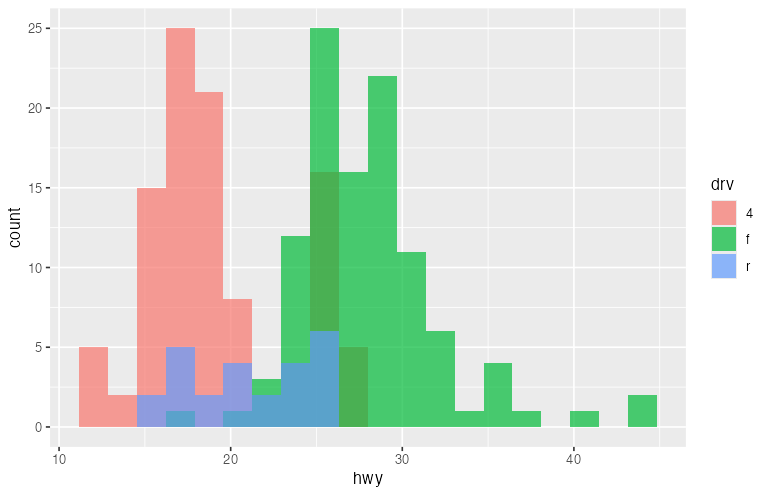

### Density: `geom_density()`

```r
library(ggplot2)

# Single density
ggplot(data = mpg, aes(x = hwy)) +
  geom_density(fill = "steelblue", alpha = 0.5)

# Multiple overlapping densities
ggplot(data = mpg, aes(x = hwy, fill = drv)) +
  geom_density(alpha = 0.5)
```

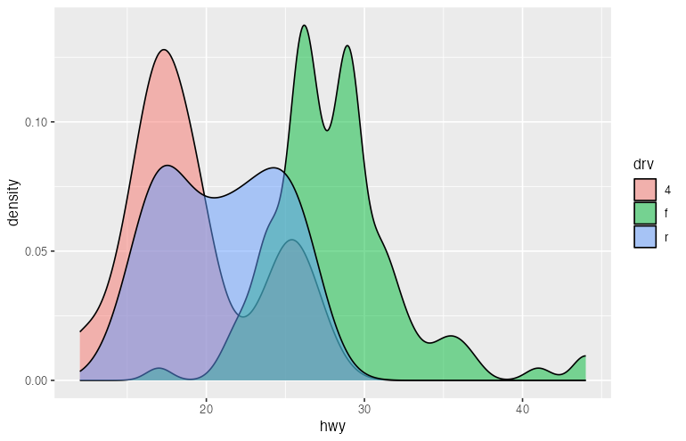

### Box Plots: `geom_boxplot()`

```r
library(ggplot2)

# Basic boxplot
ggplot(data = mpg, aes(x = class, y = hwy)) +
  geom_boxplot()

# With color
ggplot(data = mpg, aes(x = class, y = hwy, fill = class)) +
  geom_boxplot() +
  theme(legend.position = "none")

# Horizontal boxplot
ggplot(data = mpg, aes(x = class, y = hwy)) +
  geom_boxplot() +
  coord_flip()

# With notches (confidence interval for median)
ggplot(data = mpg, aes(x = class, y = hwy)) +
  geom_boxplot(notch = TRUE)
```

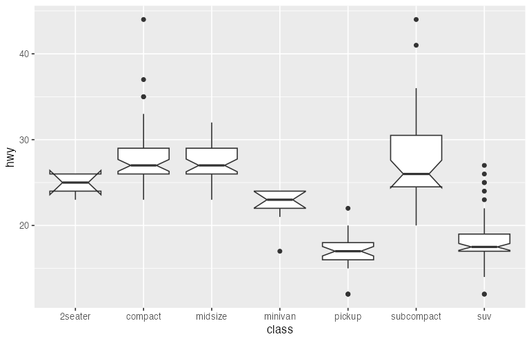

### Violin Plots: `geom_violin()`

```r
library(ggplot2)

# Basic violin
ggplot(data = mpg, aes(x = class, y = hwy)) +
  geom_violin(fill = "steelblue", alpha = 0.7)

# Violin with boxplot inside
ggplot(data = mpg, aes(x = class, y = hwy)) +
  geom_violin(fill = "lightblue") +
  geom_boxplot(width = 0.1)
```

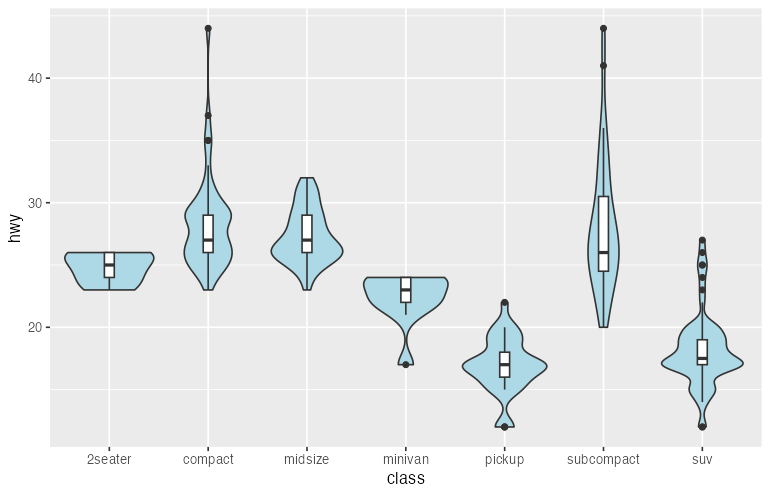

### Area: `geom_area()`

```r
library(ggplot2)

ggplot(data = economics, aes(x = date, y = unemploy)) +
  geom_area(fill = "steelblue", alpha = 0.7)
```

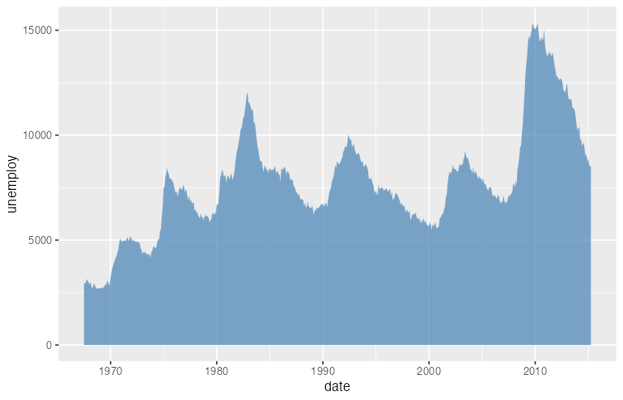

### Text and Labels: `geom_text()` and `geom_label()`

```r
library(ggplot2)
library(dplyr)

# Summarize data
mpg_summary <- mpg %>%
  group_by(class) %>%
  summarize(
    avg_hwy = mean(hwy),
    count = n()
  )

# Bar chart with labels
ggplot(data = mpg_summary, aes(x = class, y = avg_hwy)) +
  geom_col(fill = "steelblue") +
  geom_text(aes(label = round(avg_hwy, 1)), vjust = -0.5)

# Scatter plot with labels
ggplot(data = mpg_summary, aes(x = count, y = avg_hwy)) +
  geom_point(size = 4) +
  geom_label(aes(label = class), nudge_y = 1)
```

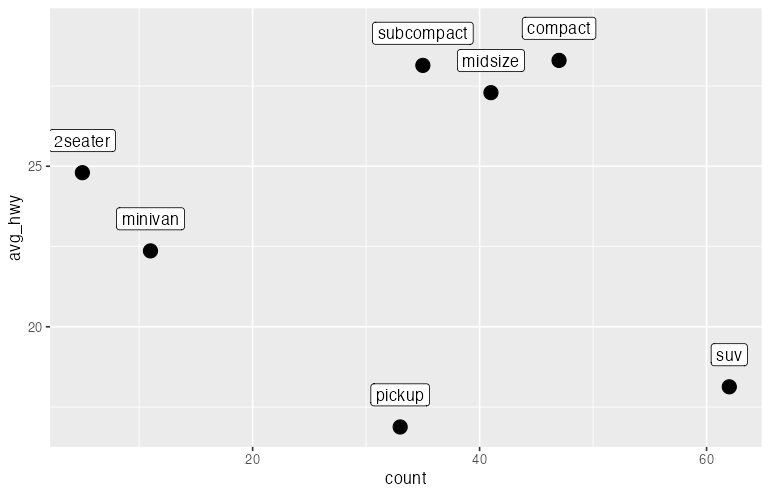

## Faceting

Faceting creates small multiples, splitting data across multiple panels.

### `facet_wrap()`

```r
library(ggplot2)

# Wrap by one variable
ggplot(data = mpg, aes(x = displ, y = hwy)) +
  geom_point() +
  facet_wrap(~ class)

# Control layout
ggplot(data = mpg, aes(x = displ, y = hwy)) +
  geom_point() +
  facet_wrap(~ class, nrow = 2)

# Free scales
ggplot(data = mpg, aes(x = displ, y = hwy)) +
  geom_point() +
  facet_wrap(~ class, scales = "free")
```

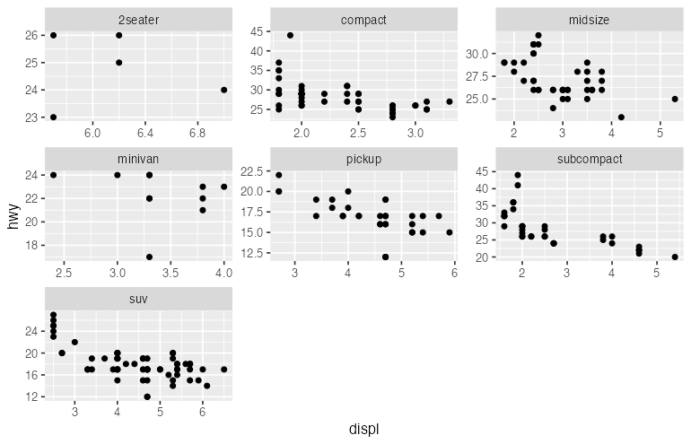

### `facet_grid()`

```r
library(ggplot2)

# Grid by two variables
ggplot(data = mpg, aes(x = displ, y = hwy)) +
  geom_point() +
  facet_grid(drv ~ cyl)

# One variable in rows only
ggplot(data = mpg, aes(x = displ, y = hwy)) +
  geom_point() +
  facet_grid(drv ~ .)

# One variable in columns only
ggplot(data = mpg, aes(x = displ, y = hwy)) +
  geom_point() +
  facet_grid(. ~ cyl)
```

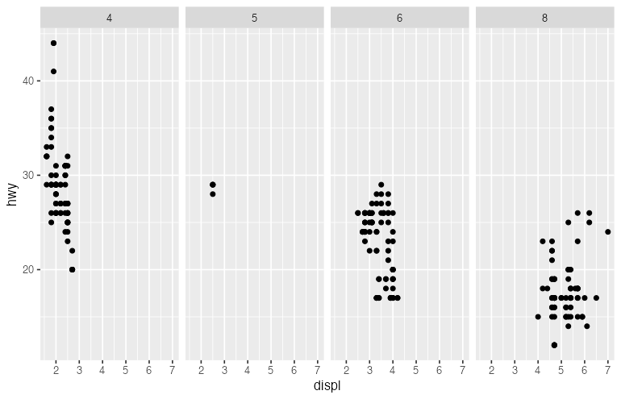

## Scales

Scales control how data values map to visual values.

### Position Scales

```r
library(ggplot2)

# Continuous scales
ggplot(data = mpg, aes(x = displ, y = hwy)) +
  geom_point() +
  scale_x_continuous(breaks = seq(1, 7, 1), limits = c(1, 7)) +
  scale_y_continuous(breaks = seq(10, 45, 5))

# Log scale
ggplot(data = diamonds, aes(x = carat, y = price)) +
  geom_point(alpha = 0.1) +
  scale_x_log10() +
  scale_y_log10()

# Reverse scale
ggplot(data = mpg, aes(x = displ, y = hwy)) +
  geom_point() +
  scale_y_reverse()
```

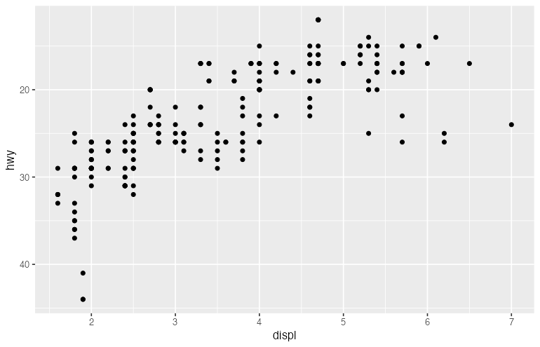

### Color Scales

```r
library(ggplot2)

# Discrete color scale
ggplot(data = mpg, aes(x = displ, y = hwy, color = class)) +
  geom_point() +
  scale_color_brewer(palette = "Set1")

# Manual colors
ggplot(data = mpg, aes(x = displ, y = hwy, color = drv)) +
  geom_point() +
  scale_color_manual(values = c("4" = "#E41A1C", "f" = "#377EB8", "r" = "#4DAF4A"))

# Continuous color scale
ggplot(data = mpg, aes(x = displ, y = hwy, color = cty)) +
  geom_point(size = 3) +
  scale_color_gradient(low = "blue", high = "red")

# Diverging color scale
ggplot(data = mpg, aes(x = displ, y = hwy, color = cty - mean(cty))) +
  geom_point(size = 3) +
  scale_color_gradient2(low = "blue", mid = "white", high = "red", midpoint = 0)

# Viridis color scale (colorblind-friendly)
ggplot(data = mpg, aes(x = displ, y = hwy, color = cty)) +
  geom_point(size = 3) +
  scale_color_viridis_c()
```

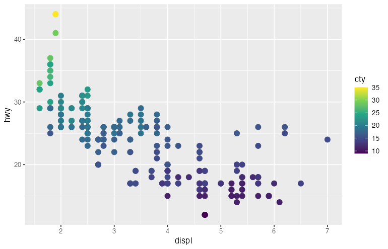

### Fill Scales

```r
library(ggplot2)

ggplot(data = mpg, aes(x = class, fill = class)) +
  geom_bar() +
  scale_fill_brewer(palette = "Pastel1")
```

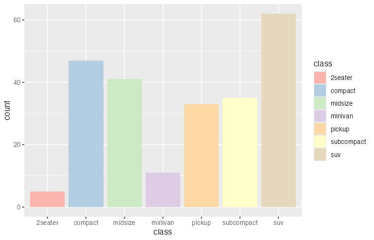

## Coordinate Systems

```r
library(ggplot2)

# Flip coordinates
ggplot(data = mpg, aes(x = class)) +
  geom_bar() +
  coord_flip()

# Fixed aspect ratio
ggplot(data = mpg, aes(x = cty, y = hwy)) +
  geom_point() +
  coord_fixed(ratio = 1)

# Polar coordinates (for pie charts)
ggplot(data = mpg, aes(x = factor(1), fill = class)) +
  geom_bar(width = 1) +
  coord_polar(theta = "y")

# Zoom without clipping data
ggplot(data = mpg, aes(x = displ, y = hwy)) +
  geom_point() +
  geom_smooth() +
  coord_cartesian(xlim = c(2, 5), ylim = c(20, 40))
```

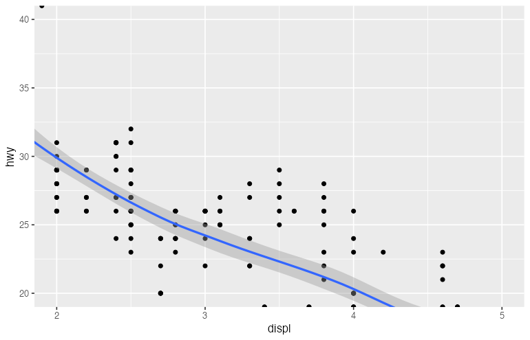

## Labels and Annotations

```r
library(ggplot2)

ggplot(data = mpg, aes(x = displ, y = hwy, color = class)) +
  geom_point() +
  labs(
    title = "Fuel Efficiency vs Engine Size",
    subtitle = "Data from EPA fuel economy tests",
    caption = "Source: fueleconomy.gov",
    x = "Engine Displacement (liters)",
    y = "Highway MPG",
    color = "Vehicle Class"
  )
```

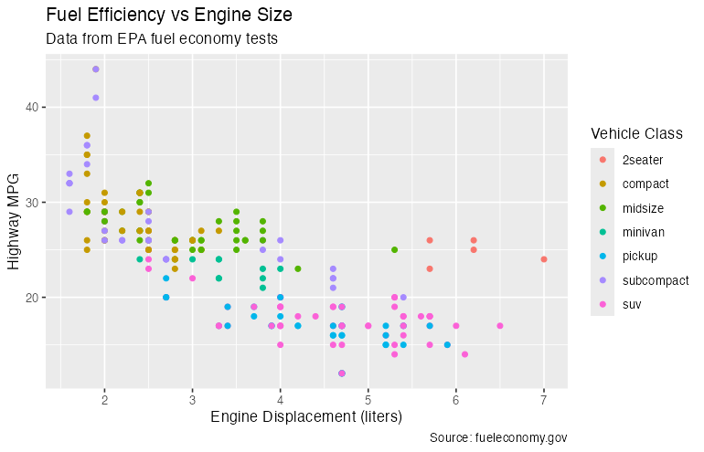

### Adding Annotations

```r
library(ggplot2)

ggplot(data = mpg, aes(x = displ, y = hwy)) +
  geom_point() +
  annotate("text", x = 5, y = 40, label = "Most efficient", color = "red") +
  annotate("rect", xmin = 1.5, xmax = 2.5, ymin = 35, ymax = 45,
           alpha = 0.2, fill = "blue") +
  annotate("segment", x = 5, y = 38, xend = 4, yend = 35,
           arrow = arrow(length = unit(0.2, "cm")))
```

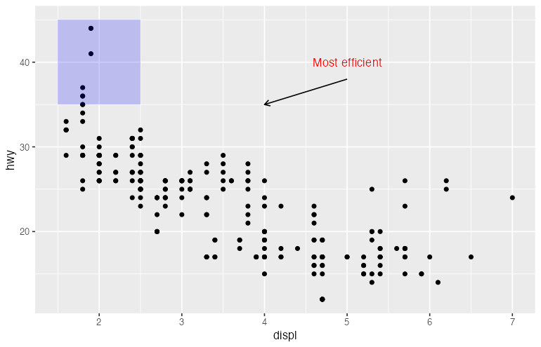

## Themes

Themes control non-data elements of the plot.

### Built-in Themes

```r
library(ggplot2)

p <- ggplot(data = mpg, aes(x = displ, y = hwy, color = class)) +
  geom_point()

# Default theme
p + theme_gray()

# Minimal theme
p + theme_minimal()

# Classic theme
p + theme_classic()

# Black and white theme
p + theme_bw()

# Light theme
p + theme_light()

# Dark theme
p + theme_dark()

# Void theme (no axes)
p + theme_void()
```

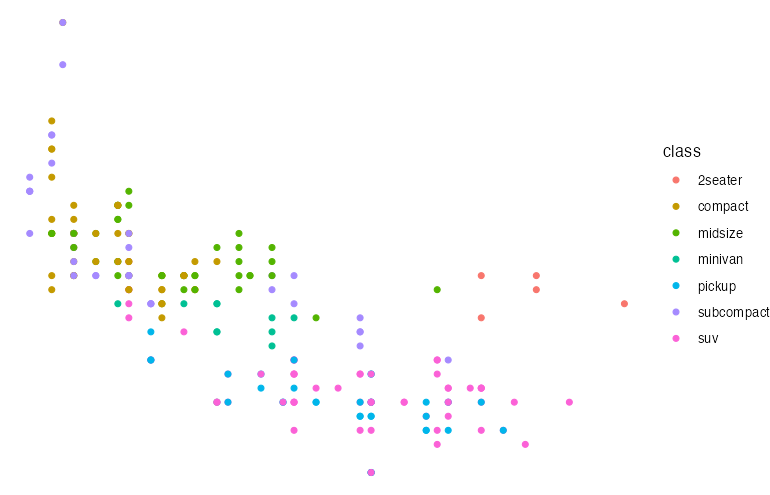

### Custom Theme Elements

```r
library(ggplot2)

ggplot(data = mpg, aes(x = displ, y = hwy, color = class)) +
  geom_point() +
  labs(title = "Fuel Efficiency") +
  theme(
    # Title
    plot.title = element_text(size = 18, face = "bold", hjust = 0.5),

    # Axis text
    axis.title = element_text(size = 14),
    axis.text = element_text(size = 12),

    # Legend
    legend.position = "bottom",
    legend.title = element_text(face = "bold"),

    # Panel
    panel.background = element_rect(fill = "white"),
    panel.grid.major = element_line(color = "gray90"),
    panel.grid.minor = element_blank(),

    # Plot background
    plot.background = element_rect(fill = "white", color = NA)
  )
```

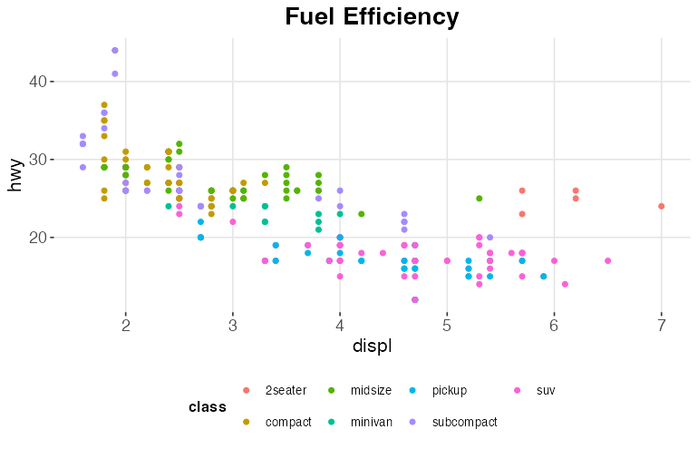

## Combining Multiple Layers

```r
library(ggplot2)

ggplot(data = mpg, aes(x = displ, y = hwy)) +
  # Layer 1: All points in light gray
  geom_point(color = "gray80", size = 2) +
  # Layer 2: Highlighted points for SUVs
  geom_point(data = subset(mpg, class == "suv"),
             color = "red", size = 3) +
  # Layer 3: Smooth line for all data
  geom_smooth(method = "lm", se = FALSE, color = "blue") +
  # Layer 4: Annotation
  annotate("text", x = 6, y = 35, label = "SUVs highlighted in red") +
  labs(title = "Engine Size vs Fuel Efficiency",
       subtitle = "SUVs highlighted")
```

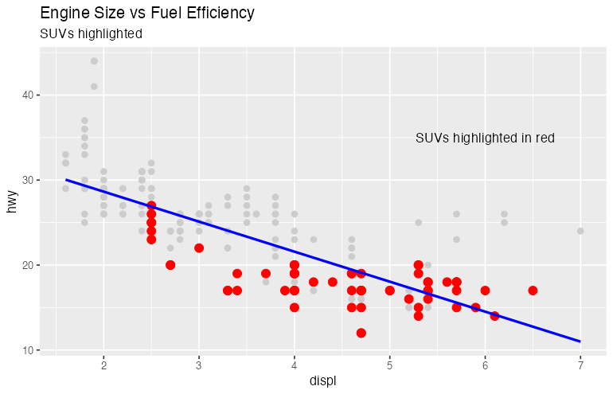

## Statistical Transformations

```r
library(ggplot2)

# Explicit stat usage
ggplot(data = diamonds, aes(x = cut)) +
  geom_bar(stat = "count")  # Default for geom_bar

# Using stat_summary
ggplot(data = mpg, aes(x = class, y = hwy)) +
  stat_summary(fun = mean, geom = "bar", fill = "steelblue") +
  stat_summary(fun.data = mean_se, geom = "errorbar", width = 0.2)

# stat_smooth
ggplot(data = mpg, aes(x = displ, y = hwy)) +
  geom_point() +
  stat_smooth(method = "loess", span = 0.3)
```

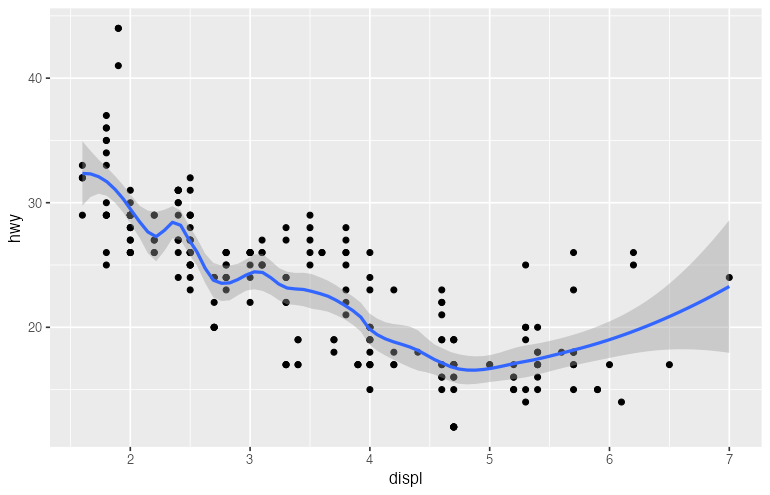

## Saving Plots

```r
library(ggplot2)

p <- ggplot(data = mpg, aes(x = displ, y = hwy, color = class)) +
  geom_point() +
  labs(title = "Fuel Efficiency")

# Save with ggsave
ggsave("my_plot.png", plot = p, width = 10, height = 6, dpi = 300)
ggsave("my_plot.pdf", plot = p, width = 10, height = 6)
ggsave("my_plot.svg", plot = p, width = 10, height = 6)

# Save last plot
ggplot(mpg, aes(displ, hwy)) + geom_point()
ggsave("last_plot.png")
```

## Summary

| Component | Purpose | Example |
|-----------|---------|---------|
| `ggplot()` | Initialize plot with data | `ggplot(data = df)` |
| `aes()` | Map variables to aesthetics | `aes(x = var1, y = var2)` |
| `geom_*()` | Add geometric objects | `geom_point()`, `geom_line()` |
| `scale_*()` | Control aesthetic mappings | `scale_color_brewer()` |
| `facet_*()` | Create small multiples | `facet_wrap(~ var)` |
| `coord_*()` | Adjust coordinate system | `coord_flip()` |
| `labs()` | Add labels | `labs(title = "...")` |
| `theme()` | Customize appearance | `theme_minimal()` |

## Further Reading

- [ggplot2 Documentation](https://ggplot2.tidyverse.org/)
- [R for Data Science - Data Visualization](https://r4ds.had.co.nz/data-visualisation.html)
- [ggplot2 Cheat Sheet](https://rstudio.github.io/cheatsheets/data-visualization.pdf)
- [The R Graph Gallery](https://r-graph-gallery.com/)
