# The Grammar of Graphics

## Overview

The Grammar of Graphics is a theoretical framework for describing and constructing statistical graphics. Developed by Leland Wilkinson in his 2005 book of the same name, it provides a systematic way to think about visualizations as compositions of independent components. This framework is the foundation of ggplot2 in R and influences many modern visualization libraries.

## Why a Grammar?

Just as natural language grammar lets us construct infinite sentences from a finite set of rules, the Grammar of Graphics lets us construct infinite visualizations from a finite set of components. This approach offers several advantages:

- **Consistency**: Every visualization follows the same structural rules
- **Flexibility**: Components can be combined in countless ways
- **Clarity**: The structure makes it clear what each part of a visualization does
- **Efficiency**: Once you learn the grammar, you can create any visualization

## The Seven Layers

The Grammar of Graphics breaks visualizations into seven fundamental components:

```
GRAPHIC = DATA + TRANS + SCALE + COORD + ELEMENT + GUIDE + (FACET)
```

### 1. Data

The foundation of every visualization is the data itself. This includes:

- The dataset being visualized
- Variables of interest
- Data types (categorical, continuous, temporal)

```r
# In ggplot2, data is the first argument
ggplot(data = mpg, ...)
```

The data layer answers: **What information are we visualizing?**

### 2. Transformations (Statistics)

Transformations convert raw data into values suitable for display. Examples:

- **Identity**: Use values as-is
- **Count**: Count occurrences (for bar charts)
- **Bin**: Group continuous data into bins (for histograms)
- **Smooth**: Calculate trend lines
- **Summary**: Compute statistics (mean, median, etc.)

```r
# Implicit transformation: geom_bar counts occurrences
ggplot(mpg, aes(x = class)) +
  geom_bar()  # stat = "count" is implicit

# Explicit transformation
ggplot(mpg, aes(x = class, y = hwy)) +
  stat_summary(fun = mean, geom = "bar")
```

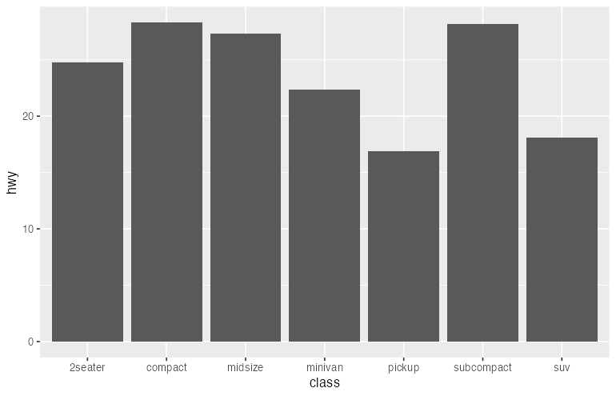

The transformation layer answers: **How should we process the data?**

### 3. Scales

Scales map data values to aesthetic values. They define:

- The range of visual properties (colors, sizes, positions)
- How data values translate to those properties
- Legends and axes

```r
# Position scales map data to x/y coordinates
# Color scales map data to colors
ggplot(mpg, aes(x = displ, y = hwy, color = class)) +
  geom_point() +
  scale_x_continuous(limits = c(1, 7)) +
  scale_color_brewer(palette = "Set1")
```

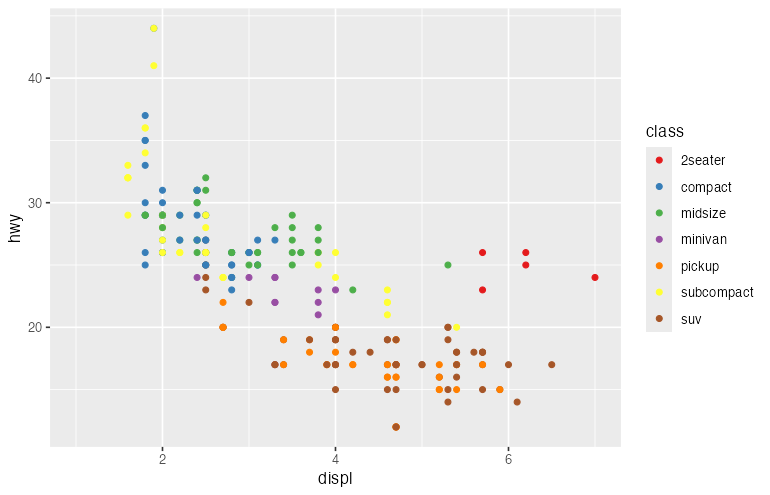

The scale layer answers: **How do data values become visual values?**

### 4. Coordinate System

The coordinate system defines how positions are interpreted and displayed:

- **Cartesian**: Standard x-y coordinates
- **Polar**: Angle and radius (for pie charts, radar charts)
- **Geographic**: Map projections
- **Flipped**: Swapped x and y axes

```r
# Cartesian (default)
ggplot(mpg, aes(x = class)) +
  geom_bar()

# Polar (creates a pie-like chart)
ggplot(mpg, aes(x = factor(1), fill = class)) +
  geom_bar(width = 1) +
  coord_polar(theta = "y")

# Flipped
ggplot(mpg, aes(x = class)) +
  geom_bar() +
  coord_flip()
```


The coordinate layer answers: **How is position space organized?**

### 5. Geometric Elements (Marks)

Geometric elements are the visual objects that represent data:

- **Points**: Scatter plots
- **Lines**: Line charts
- **Bars**: Bar charts
- **Areas**: Area charts
- **Polygons**: Maps, custom shapes

```r
# Different geoms for the same data
ggplot(economics, aes(x = date, y = unemploy)) +
  geom_line()    # Line chart

ggplot(economics, aes(x = date, y = unemploy)) +
  geom_area()    # Area chart

ggplot(economics, aes(x = date, y = unemploy)) +
  geom_point()   # Scatter plot
```

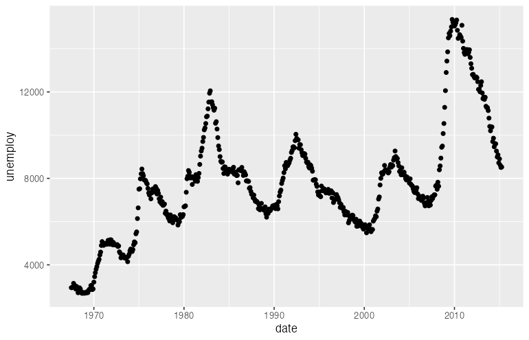

The geometry layer answers: **What visual marks represent the data?**

### 6. Aesthetic Mappings

Aesthetics connect data variables to visual properties of geometric elements:

| Aesthetic | Visual Property | Example Data |
|-----------|-----------------|--------------|
| x | Horizontal position | Continuous or categorical |
| y | Vertical position | Continuous or categorical |
| color | Outline color | Categorical or continuous |
| fill | Interior color | Categorical or continuous |
| size | Element size | Continuous |
| shape | Point shape | Categorical |
| alpha | Transparency | Continuous |
| linetype | Line pattern | Categorical |

```r
# Multiple aesthetic mappings
ggplot(mpg, aes(
  x = displ,      # Position
  y = hwy,        # Position
  color = class,  # Color encodes class
  size = cyl,     # Size encodes cylinders
  alpha = year    # Transparency encodes year
)) +
  geom_point()
```

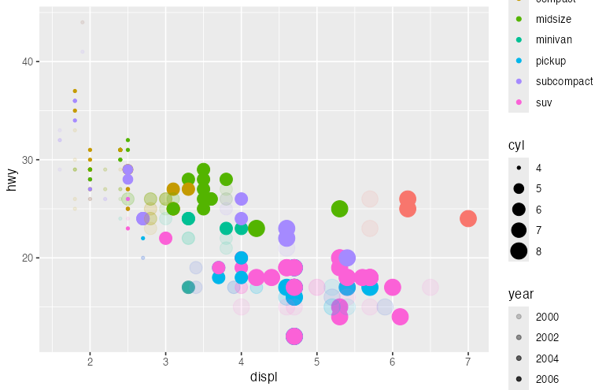

The aesthetic layer answers: **How do data variables map to visual properties?**

### 7. Guides (Legends and Axes)

Guides help readers decode the visualization:

- **Axes**: Decode position encodings
- **Legends**: Decode color, size, shape encodings
- **Annotations**: Provide context

```r
ggplot(mpg, aes(x = displ, y = hwy, color = class)) +
  geom_point() +
  guides(
    color = guide_legend(title = "Vehicle Class", ncol = 2)
  ) +
  labs(
    x = "Engine Displacement (L)",
    y = "Highway MPG"
  )
```

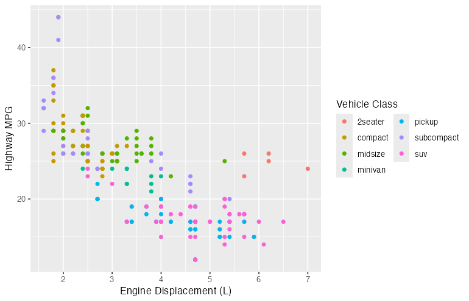

The guide layer answers: **How do readers interpret the visual encodings?**

### Faceting (Bonus Layer)

Faceting splits data into multiple panels based on categorical variables:

```r
# Facet by one variable
ggplot(mpg, aes(x = displ, y = hwy)) +
  geom_point() +
  facet_wrap(~ class)

# Facet by two variables
ggplot(mpg, aes(x = displ, y = hwy)) +
  geom_point() +
  facet_grid(drv ~ cyl)
```

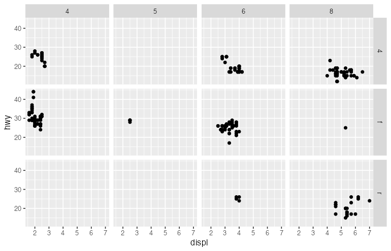

The facet layer answers: **How should we split the data into subplots?**

## Putting It All Together

Here is how all components combine to create a complete visualization:

```r
library(ggplot2)

ggplot(
  # 1. DATA: The dataset
  data = mpg,

  # 6. AESTHETICS: Map variables to visual properties
  mapping = aes(x = displ, y = hwy, color = class)
) +

  # 5. GEOMETRY: Visual representation
  geom_point(size = 3, alpha = 0.7) +

  # 2. TRANSFORMATION: Add smoothed trend line
  geom_smooth(method = "lm", se = FALSE) +

  # 3. SCALES: Control mappings
  scale_x_continuous(limits = c(1, 7), breaks = 1:7) +
  scale_y_continuous(limits = c(10, 45)) +
  scale_color_brewer(palette = "Set2") +

  # 4. COORDINATE SYSTEM
  coord_cartesian() +

  # 7. FACETING: Small multiples
  facet_wrap(~ year) +

  # 7. GUIDES: Labels and legends
  labs(
    title = "Fuel Efficiency by Engine Size",
    x = "Displacement (liters)",
    y = "Highway MPG",
    color = "Vehicle Class"
  ) +

  # THEME: Non-data appearance
  theme_minimal()
```

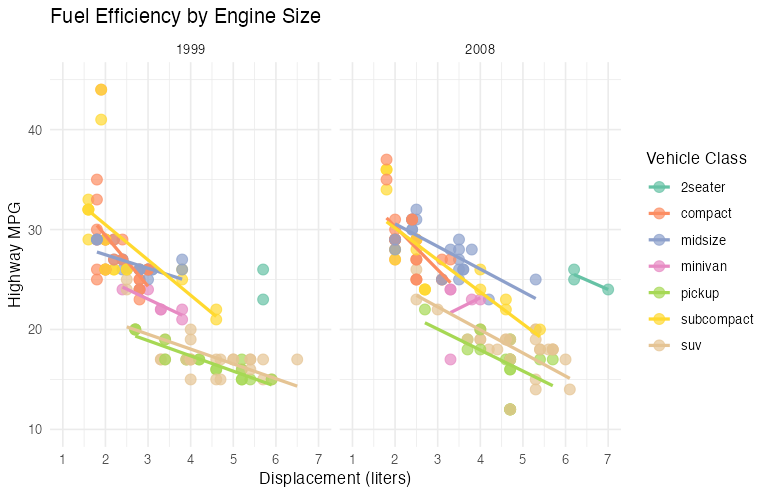

## Design Principles from the Grammar

### Principle 1: Separate Data from Representation

The same data can have multiple visual representations:

```r
# Same data, three representations
p1 <- ggplot(mpg, aes(x = class)) + geom_bar()
p2 <- ggplot(mpg, aes(x = class)) + geom_bar() + coord_polar()
p3 <- ggplot(mpg, aes(x = class)) + geom_bar() + coord_flip()
```

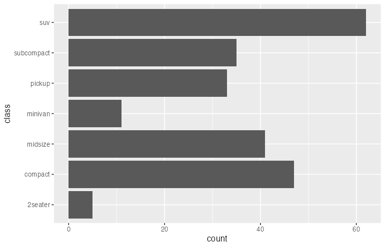

### Principle 2: Use Appropriate Scales

Different data types require different scales:

```r
# Continuous data: continuous scale
ggplot(mpg, aes(x = displ, y = hwy, color = cty)) +
  geom_point() +
  scale_color_gradient(low = "blue", high = "red")

# Categorical data: discrete scale
ggplot(mpg, aes(x = displ, y = hwy, color = class)) +
  geom_point() +
  scale_color_brewer(palette = "Set1")
```

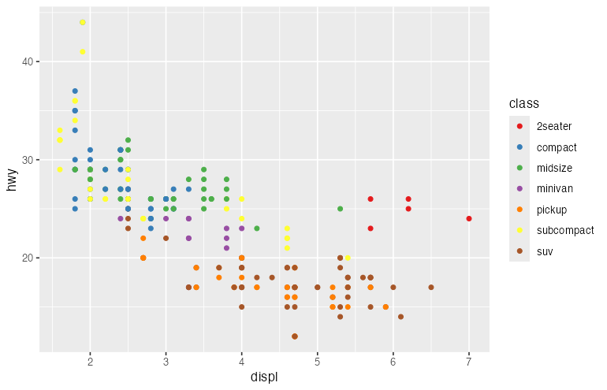

### Principle 3: Layer Information

Build complexity through layers:

```r
ggplot(mpg, aes(x = displ, y = hwy)) +
  # Layer 1: All data points
  geom_point(alpha = 0.3) +

  # Layer 2: Trend line
  geom_smooth(method = "lm", color = "blue") +

  # Layer 3: Highlighted subset
  geom_point(
    data = subset(mpg, class == "2seater"),
    color = "red", size = 4
  ) +

  # Layer 4: Annotation
  annotate("text", x = 6, y = 35, label = "2-seaters")
```

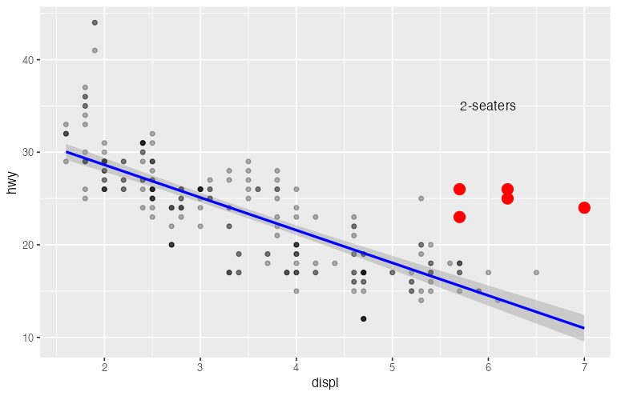

### Principle 4: Encode the Most Important Variables with the Most Effective Channels

Visual channels have different effectiveness:

**Most effective for quantitative data:**
1. Position (x, y)
2. Length
3. Angle/Slope
4. Area
5. Volume
6. Color saturation

**Most effective for categorical data:**
1. Position
2. Color hue
3. Shape
4. Texture

```r
# Position for the most important relationship
# Color for secondary grouping
ggplot(mpg, aes(
  x = displ,      # Primary: position
  y = hwy,        # Primary: position
  color = class   # Secondary: color
)) +
  geom_point()
```

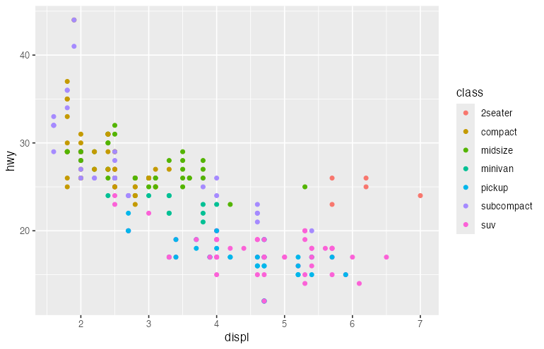

## The Grammar in Other Libraries

### Python: Plotnine

Plotnine is a Python implementation of the Grammar of Graphics:

```python
from plotnine import ggplot, aes, geom_point, labs
import pandas as pd

mpg = pd.read_csv("mpg.csv")

(
    ggplot(mpg, aes(x="displ", y="hwy", color="class"))
    + geom_point()
    + labs(title="Fuel Efficiency")
)
```

### Python: Altair

Altair uses a declarative approach inspired by the Grammar:

```python
import altair as alt
import pandas as pd

mpg = pd.read_csv("mpg.csv")

alt.Chart(mpg).mark_point().encode(
    x="displ:Q",
    y="hwy:Q",
    color="class:N"
)
```

### JavaScript: Vega-Lite

Vega-Lite is a JSON-based visualization grammar:

```json
{
  "data": {"url": "mpg.json"},
  "mark": "point",
  "encoding": {
    "x": {"field": "displ", "type": "quantitative"},
    "y": {"field": "hwy", "type": "quantitative"},
    "color": {"field": "class", "type": "nominal"}
  }
}
```

## Common Patterns

### Pattern 1: Overview + Detail

```r
# Overview
p1 <- ggplot(mpg, aes(x = displ, y = hwy)) +
  geom_point(alpha = 0.3) +
  labs(title = "All Data")

# Detail (filtered)
p2 <- ggplot(subset(mpg, class == "compact"), aes(x = displ, y = hwy)) +
  geom_point() +
  geom_smooth(method = "lm") +
  labs(title = "Compact Cars Only")

library(patchwork)
p1 + p2
```

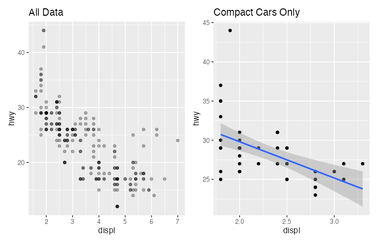

### Pattern 2: Small Multiples

```r
ggplot(mpg, aes(x = displ, y = hwy)) +
  geom_point() +
  geom_smooth(method = "lm", se = FALSE) +
  facet_wrap(~ class, scales = "free")
```

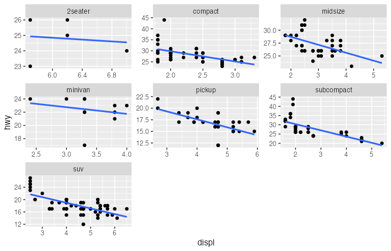

### Pattern 3: Layered Annotations

```r
ggplot(mpg, aes(x = displ, y = hwy)) +
  geom_point(alpha = 0.5) +
  geom_smooth(method = "lm", se = TRUE) +
  geom_hline(yintercept = mean(mpg$hwy), linetype = "dashed", color = "red") +
  annotate("text", x = 6, y = mean(mpg$hwy) + 2,
           label = paste("Mean:", round(mean(mpg$hwy), 1)))
```

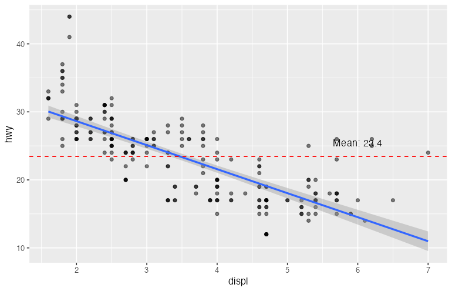

## Summary

The Grammar of Graphics provides a systematic framework for creating visualizations:

| Component | Question Answered | ggplot2 Function |
|-----------|-------------------|------------------|
| Data | What to visualize? | `ggplot(data = ...)` |
| Aesthetics | How to map variables? | `aes(...)` |
| Geometry | What visual marks? | `geom_*()` |
| Statistics | How to transform? | `stat_*()` |
| Scales | How to map values? | `scale_*()` |
| Coordinates | How to interpret position? | `coord_*()` |
| Facets | How to split into panels? | `facet_*()` |
| Guides | How to decode? | `labs()`, `guides()` |
| Theme | How should it look? | `theme()` |

Understanding this grammar empowers you to:
- Create any visualization by composing components
- Reason about why certain visualizations work better than others
- Quickly modify and iterate on designs
- Translate designs between different visualization libraries

## Further Reading

- Wilkinson, L. (2005). *The Grammar of Graphics* (2nd ed.). Springer.
- Wickham, H. (2010). A Layered Grammar of Graphics. *Journal of Computational and Graphical Statistics*, 19(1), 3-28.
- [ggplot2 Book](https://ggplot2-book.org/)
- [Vega-Lite Documentation](https://vega.github.io/vega-lite/)
