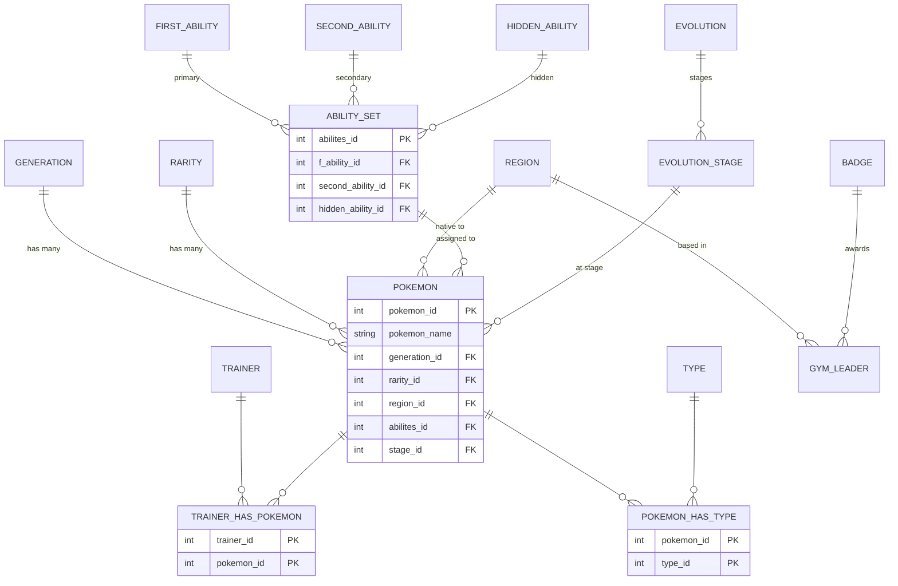

# Schema Design

## Overview

Before you can query a database you have to *design* one: decide what the tables are, what
keys tie them together, and how to split data so nothing is duplicated. I learned this by
building a Pokemon database in MySQL Workbench for a BYU-Idaho assignment — 18 tables
covering pokemon, abilities, types, regions, generations, rarity, evolution, trainers,
gyms, and the junction tables that connect them. It's a good teaching schema precisely
because it exercises all three relationship types (one-to-one, one-to-many, many-to-many)
— and because it has a few real bugs that make good cautionary tales.

Source: `~/Projects/…/07-sql-and-databases/db_assignment/pokemon_erd.sql` (my own MySQL
Workbench forward-engineered schema, 2023, BYU-Idaho). Relational-fundamentals framing from
STAT 624 Week 3 (local: `course-files/07-sql-and-databases/Week 3_RDBM.pdf`) —
instructor-copyrighted, summarized only.

## Keys

- **Primary key** — the column (or columns) that uniquely identifies a row. Every table
  above has one (`pokemon_id`, `type_id`, …). It must be unique and non-null.
- **Foreign key** — a column that references another table's primary key, enforcing that
  the reference actually exists (referential integrity). `pokemon.generation_id` is a
  foreign key into `generation.generation_id`.
- **Composite primary key** — for a junction table, the primary key is *both* foreign
  keys together: `pokemon_has_type`'s key is `(pokemon_id, type_id)`, which also stops the
  same pairing being inserted twice.

## The ERD

Here's the core of my schema, redrawn (I regenerated this from the SQL rather than
screenshotting the Workbench diagram). It shows the three relationship shapes at once:

Reading the cardinality:

- **One-to-many** (`||--o{`): one `generation` has many `pokemon`; one `pokemon` belongs to
  one generation. The "many" side holds the foreign key. This is the most common shape.
- **Many-to-many**: `pokemon` ↔ `type` and `trainer` ↔ `pokemon`. Neither side can hold the
  foreign key (a pokemon has multiple types, a type has multiple pokemon), so a **junction
  table** (`pokemon_has_type`, `trainer_has_pokemon`) sits between them holding one row per
  pairing.
- **The ability hub**: `abilites` is a set-row pointing at up to three separate ability
  tables (first / second / hidden), then `pokemon` points at the set. It's how I modeled
  "a pokemon has one primary, an optional secondary, and an optional hidden ability" without
  three nullable columns on `pokemon` itself.

## Normalization

Normalization is the discipline of **not repeating data**. Instead of storing the string
`"Kanto"` on every Kanto pokemon, I store it once in a `region` table and reference it by
`region_id`. Benefits: renaming a region is a one-row update, and you can't misspell it into
two different values. That's roughly **third normal form** — every non-key column depends on
the key, and nothing but the key. The cost is that reassembling a human-readable view takes
joins (see the master query on the [SQL Essentials](sql-essentials.md#joins) page), which is
the trade you make for integrity.

## Gotchas

These are real defects in my own 2023 schema — I'm keeping them here because each one is a
lesson, and because I had to fix them before the schema would load into SQLite for the
[notebook](notebooks/pokemon-sql.ipynb):

- **Duplicate column — the `gym` table has two `location` columns.** MySQL Workbench let me
  forward-engineer `CREATE TABLE gym (gym_id INT, location VARCHAR(45), location
  VARCHAR(45))`. MySQL with a loose SQL mode tolerated it; SQLite rejects it outright with
  "duplicate column name". Lesson: a permissive engine will happily let you ship a broken
  schema. I dropped the second `location` to load it.
- **Empty stub tables.** `table1` and `table2` are `CREATE TABLE … ()` with no columns —
  leftovers I forgot to delete in Workbench. They do nothing but clutter and won't even
  create in stricter engines. Clean these up before calling a schema done.
- **Redundant columns on `pokemon`.** There's both a `stage_id` (typed `VARCHAR`) and a
  `stage_id1` (the real `INT` foreign key into `evolution_stage`) — I clearly renamed
  during design and left the orphan behind. Two columns that look like they mean the same
  thing is a trap for whoever queries it next (including future me).
- **Foreign key pointing the wrong way.** The original `region` table carries a
  `pokemon_id` foreign key, implying "a region belongs to one pokemon" — backwards. A
  region has many pokemon, so the FK belongs on `pokemon` (as `region_id`). I corrected the
  direction in the notebook's adapted schema; the ERD above shows the fixed version.
- **MySQL-isms don't port.** `ENGINE=InnoDB`, backtick identifiers, `VISIBLE` index
  qualifiers, and the `SET @OLD_UNIQUE_CHECKS=…` session lines are all MySQL-specific and
  have to be stripped to run the same schema under SQLite. The [notebook](notebooks/pokemon-sql.ipynb)
  documents exactly which adaptations I made.
