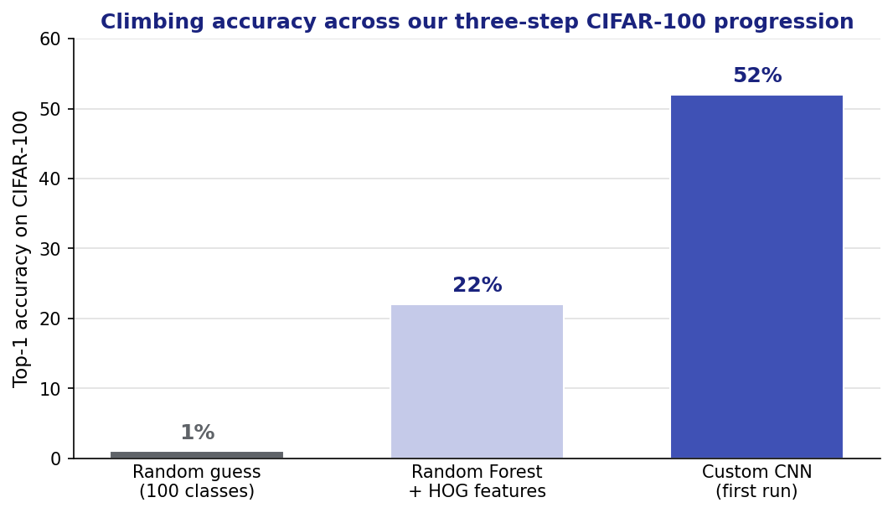

# Case Study: CIFAR-100 Image Classification

## Summary

This is the one project in the chapter where I put the classical and deep-learning tracks
head to head on the *same* hard problem: classifying CIFAR-100, 60,000 tiny 32×32 color
images spread across 100 fine-grained classes. It was a four-person group project with TAMU
classmates for ECEN 758, and we deliberately built up through three increasingly capable
approaches — a **Random Forest on hand-crafted features**, a **custom CNN**, and **CLIP-based
transfer learning** — with PCA and normalization as preprocessing. The short version: the CNN
learned its own features and more than doubled the random-forest baseline. The longer version
includes an honest lesson about a write-up we never finished. Pieces of this project also show
up on the [Random Forests](classification/random-forests.md),
[CNN](deep-learning/cnns.md), and [PCA](dimensionality-reduction/pca.md) pages; this page is
the whole story in one place.

## The problem

CIFAR-100 is the harder sibling of CIFAR-10: 100 classes instead of 10, each with 600 images
(so 500 training + 100 test per class, 50,000 / 10,000 overall), plus a coarser grouping into
20 superclasses (e.g. the "flowers" superclass holds orchids, poppies, roses, sunflowers,
tulips). At 32×32 pixels the images are small and the classes are fine-grained, which is why
even a decent model lands well below the numbers people quote for CIFAR-10. The floor to beat
is **1% — random guessing across 100 classes** — so any real signal has to clear that by a
wide margin before it means anything.

The classes are balanced, so accuracy is a fair top-line metric here (no majority class to
hide behind). What makes it hard isn't imbalance, it's that 32×32 gives the model very little
to work with per class.

## How I did it

*Source: our ECEN 758 CIFAR-100 group project — a four-person group project with TAMU
classmates. Draft write-ups:
`course-files/appendix/Homework/ecen758_hw/group_project/ecen758_group_report.pdf` and
`CNN_draft2.pdf`. All numbers below are re-verified against those drafts; where the drafts
left a blank, this page says so instead of guessing.*

### Step 0 — EDA and dimensionality reduction

Before modeling we looked at the data. Two checks shaped what we did next:

- **RGB channel distributions.** Plotting the red/green/blue pixel-value histograms showed no
  extreme skew — no unusually high- or low-contrast images that would need special handling.
  The color range was "standard," which told us the difficulty was in the *shapes*, not the
  color.
- **A t-SNE map on top of a 50-component PCA.** We reduced each image to 50 principal
  components and then ran t-SNE to project to 2-D. The takeaway was sobering: **no clear
  clusters.** A few classes (`aquarium_fish`) pulled apart cleanly; others (`bottle`) smeared
  across the whole map. High overlap in 2-D is a preview that 100-way classification will be
  genuinely hard — see [PCA](dimensionality-reduction/pca.md) for how the reduction step
  works.

Normalization (PIL image `0–255` → tensor `0–1`, then standardizing by channel mean/std) was
the other preprocessing step, applied before every model.

### Step 1 — Random Forest on hand-crafted features (the baseline)

The point of a classical baseline is to have an honest floor the deep model has to beat. A
random forest can't do anything useful with raw pixels, so we hand-built a feature extractor
in three steps: (1) the intensity of each of the three RGB channels, (2) a grayscale
conversion to expose edges and shapes, and (3) a measure of how dense those
highlight/shadow regions are — i.e. **HOG-style** (histogram-of-oriented-gradients) features.
A 100-tree forest on those features reached **about 22% accuracy** — real signal over the 1%
floor, and better on some classes (`apple`) than others, but clearly capped by features *we*
had to design by hand.

See [Random Forests](classification/random-forests.md) for the forest itself.

### Step 2 — a custom CNN (the winner)

The CNN is the reason a forest-on-HOG is only a baseline: instead of us designing features, the
network **learns** them. We stacked three convolutional blocks, each with 3×3 kernels and ReLU
activations, and max-pooling between blocks to shrink spatial resolution while growing
feature-map depth — from the 3 input RGB channels up to 256 channels at a 4×4 spatial size by
the last block. Training config:

- **25 epochs** — chosen because that's where training loss and accuracy flattened
- **Adam** optimizer at **learning rate 0.001**
- **L2 weight regularization** and **cross-entropy loss**

The first run reached **about 52% accuracy** — more than double the random-forest baseline on
the exact same data. The loss curves told a second story worth noticing: training loss kept
falling toward zero while validation loss started climbing partway through, the classic
signature of a model beginning to overfit. That gap is *why* the regularization (and the epoch
cutoff) mattered, and it's the honest asterisk on the 52%.

See [Convolutional Neural Networks](deep-learning/cnns.md) for more on the architecture.

### Step 3 — CLIP transfer learning (the unfinished track)

The third approach was to lean on a pretrained vision-language model (CLIP) and use its image
features for transfer learning — the modern move when you have limited data and a hard task.
This is where I have to be honest: **the draft never reported a CLIP accuracy number.** It was
one of our three planned approaches and it's named in the report's introduction, but the
results section that would have quantified it was still a placeholder when the draft was
handed off. So I'm not going to put a number on it — see the gotcha below.

### Where each approach landed

The story of the project in one figure: hand-crafted features clear the random-guess floor,
and learned features roughly double them. CLIP isn't plotted because the draft never gave it a
number.

## Gotchas

- **Finish the write-up.** The single most useful lesson from this project isn't technical:
  both draft reports were left with literal placeholders — the abstract still says
  `**ADD FINDINGS FROM MODEL**`, and the body has `***PCA info***` and a
  `*** [teammate] improve of model ****` note where results were supposed to go. Good work in the
  notebooks doesn't count for much if the report that communicates it never gets finished. It
  also means I can only stand behind the numbers that made it concretely into the drafts (22%,
  52%) — the CLIP result and the "improved CNN" result don't exist in a form I can cite, so I
  don't cite them.
- **Learned features beat hand-crafted ones on images.** The whole 22% → 52% jump is one
  argument: don't spend effort hand-designing HOG features if convolutions can learn better
  ones end to end. HOG was the right *baseline*, not the right *answer*.
- **1% is the number to keep in mind.** 52% top-1 sounds low next to CIFAR-10 write-ups, but
  chance here is 1% and the classes are fine-grained. Always read accuracy against the
  random-guess floor, not against a different dataset's leaderboard.
- **Watch the train/val gap, not just the final number.** The CNN's validation loss turned
  upward while training loss kept dropping — it was overfitting before the epoch budget ran
  out. The reported accuracy is a snapshot; the curves are what tell you whether to trust it.
- **A 2-D embedding is a difficulty preview, not a verdict.** The t-SNE map showing no clean
  clusters correctly predicted a hard problem, but "no clusters in 2-D" doesn't mean the
  classes are inseparable in the original high-dimensional space — the CNN found structure the
  t-SNE map couldn't show.
- **It was a group effort.** The CNN, random-forest, and CLIP tracks were divided across the
  four of us; I'm describing the project as a whole, not claiming every track as solo work.

## References

- Our ECEN 758 CIFAR-100 group project drafts (own co-authored work):
  `course-files/appendix/Homework/ecen758_hw/group_project/ecen758_group_report.pdf`,
  `CNN_draft2.pdf`. Attributed generically to a four-person group project with TAMU
  classmates.
- CIFAR-100 dataset: Krizhevsky, *Learning Multiple Layers of Features from Tiny Images*
  (2009), <https://www.cs.toronto.edu/~kriz/cifar.html> (public).
