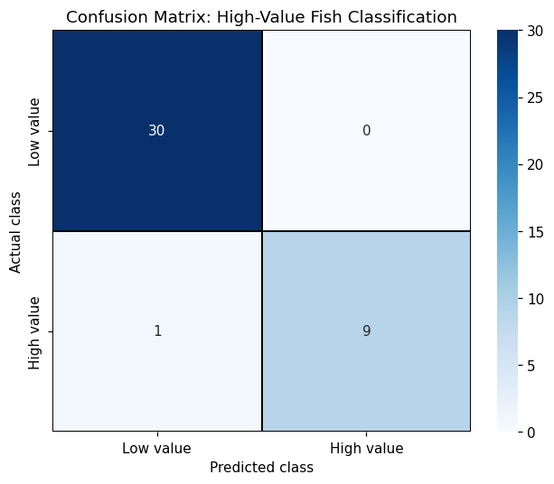

# Classification Metrics

## Summary

For a classifier, the raw material is the **confusion matrix** — the 2×2 (or K×K) table of what
the model predicted against what was true. Every headline metric is just an arithmetic
combination of its cells:

- **Accuracy** — fraction correct overall. Fine when classes are balanced, misleading when they
  aren't.
- **Precision** — of the things I flagged positive, how many really were. Punishes false alarms.
- **Recall** (sensitivity) — of the actual positives, how many I caught. Punishes misses.
- **F1** — the harmonic mean of precision and recall, for when you need one number that respects
  both.

The formulas, the TN/FP/FN/TP breakdown, and `ConfusionMatrixDisplay` mechanics are all worked
out (on synthetic churn/credit data) in
[Statistics → Logistic Regression](../03-statistics/regression/logistic.md#model-evaluation).
This page is the *applied* layer: the same metrics computed and read on two real classifiers from
my coursework.

## How I did it — a confusion matrix on real data

In my STAT 650 final I built a logistic-regression classifier to flag **high-value fish** (top
quartile by weight) from their physical dimensions on the public Fish Market dataset. The full
run — with a fitted model, ROC curve, and odds ratios — is the
[Classification Metrics Demo notebook](notebooks/classification-metrics-demo.ipynb); here's the
metrics core:

```python
from sklearn.metrics import (accuracy_score, confusion_matrix,
                             classification_report, roc_auc_score)

log_reg = LogisticRegression().fit(X_train_scaled, y_train)
y_pred  = log_reg.predict(X_test_scaled)
y_proba = log_reg.predict_proba(X_test_scaled)[:, 1]

print(classification_report(y_test, y_pred, target_names=["Low value", "High value"]))
print(f"Test accuracy: {accuracy_score(y_test, y_pred):.4f}")
print(f"Test ROC-AUC:  {roc_auc_score(y_test, y_proba):.4f}")
```

Source: `docs/10-model-evaluation/notebooks/classification-metrics-demo.ipynb`, rebuilt from
`course-files/appendix/Homework/stat650_hw/final/STAT650-F25-Final.ipynb` (my own code)

On the held-out 25%, the model scored **97.5% accuracy** with this confusion matrix:



The whole story is in the off-diagonal. There were **zero false positives** and exactly **one
false negative** — one genuinely high-value fish the model called low-value. That single cell is
why the per-class numbers diverge:

| Class | Precision | Recall | F1 |
|---|---|---|---|
| Low value | 0.97 | 1.00 | 0.98 |
| High value | 1.00 | 0.90 | 0.95 |

Because roughly 26% of the fish are high-value, **accuracy of 97.5% hides the miss** — a
"always predict low value" baseline would already score ~74%. The metric that actually matters
here is **high-value recall (0.90)**: in a purchasing context, a missed valuable fish is the
expensive error, and recall is the only number that surfaces it. This is the entire argument for
looking past accuracy on imbalanced problems, made concrete by one misclassified fish.

## How I did it — comparing two classifiers with the same report

Metrics earn their keep most when you're choosing *between* models. In ECEN 758 HW 3 I ran
Gaussian Naive Bayes against k-Nearest Neighbors on a labeled morphology dataset (the standard
public "crabs" set), split by row order, and scored both with the same `classification_report`
so the comparison was apples-to-apples:

```python
from sklearn.naive_bayes import GaussianNB
from sklearn.neighbors import KNeighborsClassifier
from sklearn.metrics import (accuracy_score, precision_score,
                             recall_score, f1_score, classification_report)

X_train, X_test = X[:140], X[140:]
y_train, y_test = y[:140], y[140:]

gnb = GaussianNB().fit(X_train, y_train)
knn = KNeighborsClassifier().fit(X_train, y_train)      # default k = 5

for name, model in [("GaussianNB", gnb), ("kNN", knn)]:
    y_hat = model.predict(X_test)
    print(name, "accuracy:", accuracy_score(y_test, y_hat))
    print(classification_report(y_test, y_hat))
```

Source: `course-files/appendix/Homework/ecen758_hw/ecen758_hw3.ipynb` (my own code)

The point of the exercise wasn't the API — it was reading the two reports side by side to see
*where* each model failed, which is invisible from a single accuracy number. The algorithms
themselves are covered on their own pages:
[k-Nearest Neighbors](../08-machine-learning/classification/knn.md) and
[Naive Bayes](../08-machine-learning/classification/naive-bayes.md). What this chapter adds is
the evaluation framing: **same metric, same split, both models — that's the only fair way to
compare.**

## Gotchas

- **Accuracy is a trap on imbalanced classes.** The fish problem is ~26% positive; accuracy
  rewards a model for getting the majority right and barely registers a missed minority case.
  Always read per-class recall, not just the headline.
- **Precision and recall trade off — decide which error is expensive first.** Zero false
  positives (precision 1.0) but one false negative (recall 0.90) is a *choice* baked into the
  0.5 threshold. If missing a positive costs more than a false alarm, you'd rather move the
  threshold to buy recall (see [ROC & AUC](roc-auc.md)).
- **`classification_report` averages can flatter you.** The `weighted avg` row is dominated by
  the majority class. On imbalanced data, the `macro avg` (unweighted across classes) is the
  more honest single number.
- **A confusion matrix without labels is a guessing game.** Always pass explicit
  `xticklabels`/`yticklabels` (or `target_names`) — a raw 2×2 with no class names invites you to
  swap precision and recall, which silently inverts the whole interpretation.
