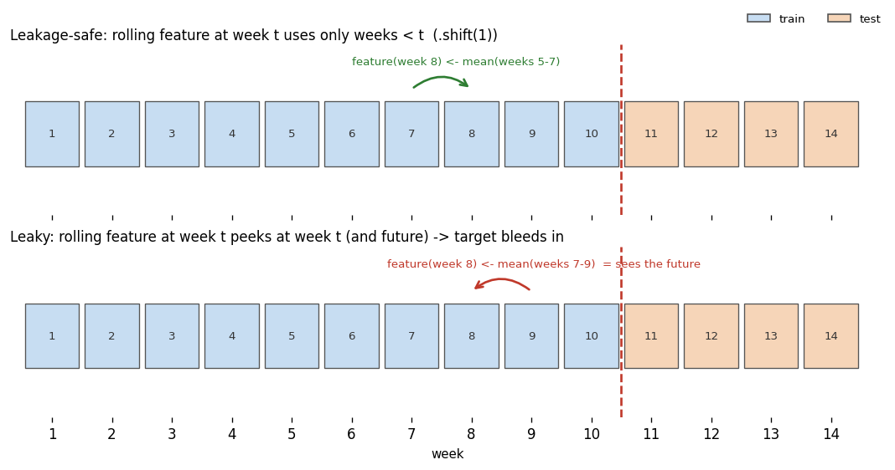

# Leakage Patterns

## Summary

Data leakage is when information the model shouldn't have at prediction time sneaks into training,
so your evaluation reports a number the model can never actually hit in production. It is the
**signature failure mode of model evaluation** — and the reason "great in the notebook, useless in
the real world" happens. Leakage doesn't make your model worse; it makes your *measurement* of the
model dishonestly good, which is worse, because you ship it believing the number.

I've hit — or written code specifically to prevent — three distinct flavours across this book.
This page collects them in one place. None of it is new material; it's the leakage discipline
already threaded through [ch08](../08-machine-learning/fundamentals/overview.md) and
[ch09](../09-time-series-forecasting/ml/feature-engineering.md), pulled together so the pattern is
visible as one theme.

## Pattern 1 — Temporal leakage: a feature that peeks at the future

The one I've fought most, because time-series features are built to look at their own history and
it's one line to accidentally include the present. A rolling mean computed as
`series.rolling(7).mean()` includes the current row — so the feature for week *t* contains week
*t*'s value, which is (part of) the target. The fix is to **shift before rolling**:

```python
# Wrong: the window includes the current period (leakage)
df["roll_mean_7"] = df["demand"].rolling(7).mean()

# Right: .shift(1) first, so week t's feature uses only weeks < t
df["roll_mean_7"] = df["demand"].shift(1).rolling(7).mean()
```



The top track is safe: the feature at week 8 is built from weeks 5–7, all strictly in its past.
The bottom track leaks: a centered/unshifted window at week 8 pulls in weeks 7–9, so it "sees" week
9 — future information relative to the prediction. Train a model on the leaky features and the test
score looks fantastic; deploy it and the future columns are `NaN`, because the future hasn't
happened yet.

This is documented in depth in
[Time Series → Feature Engineering](../09-time-series-forecasting/ml/feature-engineering.md#avoiding-data-leakage).
My [distribution demand-forecasting](../09-time-series-forecasting/index.md) pipeline enforces it
structurally: lags are computed with `.shift(lag)` inside a `groupby(['Stock','Warehouse'])` (so a
plain shift can't bleed the last row of one series into the first row of the next), the rule is
spelled out in the docstring, and a dedicated `test_data_leakage.py` **asserts** that no feature at
week *t* uses week *t*'s demand. The
[Distribution Feature Engineering Demo notebook](../09-time-series-forecasting/notebooks/distribution-feature-engineering-demo.ipynb)
recreates that assertion on synthetic data.

## Pattern 2 — Preprocessing leakage: fitting a transform on the full dataset

Any transform that *learns* from the data — a `StandardScaler`, a `MinMaxScaler`, an imputer's
column means, a `PCA` — has to be fit on the **training set only**. Fit it on everything and the
test set's mean and standard deviation are folded into the scaling that training sees. It's a small
leak, but it's a leak, and it inflates the test score:

```python
# Wrong: scaler learns from test rows too
X_scaled = StandardScaler().fit_transform(X)          # then split -> leak
X_train, X_test = train_test_split(X_scaled, ...)

# Right: split first, fit on train, only transform test
X_train, X_test = train_test_split(X, ...)
scaler = StandardScaler().fit(X_train)
X_train_scaled = scaler.transform(X_train)
X_test_scaled  = scaler.transform(X_test)
```

This is the [ch08 overview gotcha](../08-machine-learning/fundamentals/overview.md#gotchas)
("fitting on the full set leaks test statistics"), and it's exactly the order the
[Classification Metrics Demo notebook](notebooks/classification-metrics-demo.ipynb) follows —
split, then `fit` the scaler on train, then `transform` test. The cross-validation twist is
sharper still: inside a k-fold loop, fitting the scaler once on all training data leaks each fold's
validation statistics into its own training. A `Pipeline` that re-fits the scaler *inside* each
fold is the clean fix ([Cross-Validation & Splitting](cross-validation-and-splitting.md)).

## Pattern 3 — Evaluation leakage: scoring on the data you tuned on

The subtlest one, because no future information is involved — you just reuse the same split for two
jobs. If you tune hyperparameters against a validation set and then *report that same validation
score* as your result, the number is optimistic: you selected the model to look good on exactly
those rows. The fix is a clean separation of duties:

- a **training** set to fit,
- a **validation** set (or cross-validation folds) to tune and gate early stopping,
- a **test** set touched exactly once, for the final number.

My STAT 654 XGBoost project does this with a three-way split — validation drives early stopping,
the test set is scored once — detailed in the
[ch08 overview](../08-machine-learning/fundamentals/overview.md#how-i-did-it-the-split-that-makes-validation-honest).
The same discipline is why the `cv=10` inside `RidgeCV`
([previous page](cross-validation-and-splitting.md)) selects the penalty but does **not** double as
the reported score — the held-out test set still judges the tuned model.

## The unifying rule

All three collapse to one sentence: **at evaluation time, the model must only have access to what
it would genuinely have at prediction time.** Not the future (Pattern 1), not the test set's
statistics (Pattern 2), not the fact that it was selected on these very rows (Pattern 3). When a
test score looks too good, my first move is never "nice model" — it's to go hunting for which of
these three leaked.

## Gotchas

- **Leakage makes the model look *better*, which is why it's dangerous.** A bug that hurt your
  score would get caught. Leakage flatters you, so it survives to production and fails there.
- **Random splits leak on time series.** Shuffling rows puts future observations in the training
  set relative to test ones. Temporal data needs a *chronological* split — train on the past, test
  on the future — not `train_test_split(shuffle=True)`.
- **Target-derived features are silent leaks.** Anything computed using the target (an encoding of
  a category by its mean target value, a "days since last purchase" that counted the purchase
  you're predicting) leaks by construction. Audit every engineered feature for whether it could be
  known *before* the label exists.
- **Leakage hides inside library convenience.** `fit_transform(X)` on the whole frame,
  `rolling().mean()` without a shift, a groupby that spans series — the leaky version is usually
  the shorter, more natural line of code. Prevention is a habit, not a warning the library gives
  you.
