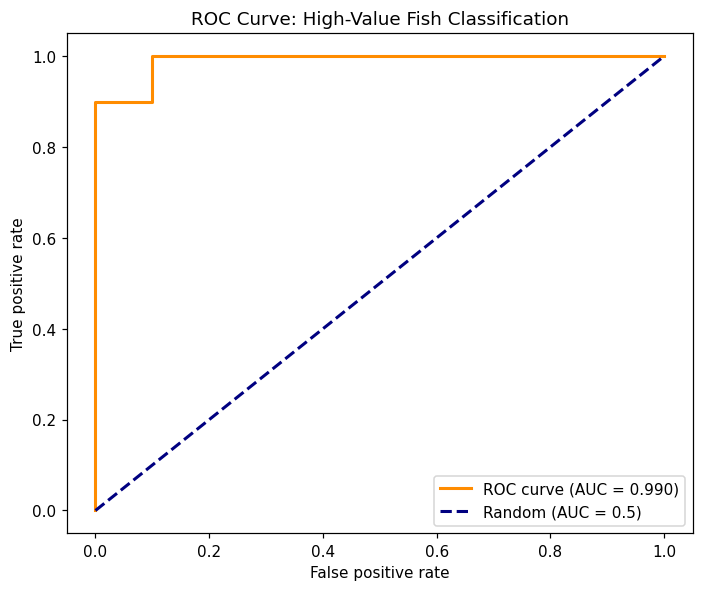

# ROC & AUC

## Summary

A confusion matrix is a snapshot at **one** probability threshold (usually 0.5). But a classifier
doesn't output classes — it outputs *scores*, and 0.5 is an arbitrary place to cut. The **ROC
curve** sweeps every possible threshold and traces the true-positive rate against the
false-positive rate; the **area under it (AUC)** collapses that whole curve into one
threshold-free number measuring how well the model's scores separate the two classes.

- **AUC = 0.5** — the model ranks positives no better than a coin flip (the diagonal).
- **AUC = 1.0** — perfect separation: every positive scores above every negative.
- **In between** — the probability that a random positive outranks a random negative.

The mechanics — building the curve with `roc_curve`, computing `roc_auc_score`, and the
threshold-analysis walkthrough — are in
[Statistics → Logistic Regression](../03-statistics/regression/logistic.md#roc-curve-and-auc).
This page is the applied layer: a real ROC curve off my own model, and why AUC is the metric I
reach for when comparing classifiers.

## How I did it — a real ROC curve

Same STAT 650 fish classifier as the [Classification Metrics](classification-metrics.md) page.
The curve comes straight from the predicted probabilities:

```python
from sklearn.metrics import roc_curve, roc_auc_score

y_proba = log_reg.predict_proba(X_test_scaled)[:, 1]   # positive-class scores
fpr, tpr, thresholds = roc_curve(y_test, y_proba)
auc = roc_auc_score(y_test, y_proba)

plt.plot(fpr, tpr, label=f"ROC curve (AUC = {auc:.3f})")
plt.plot([0, 1], [0, 1], "--", label="Random (AUC = 0.5)")
```

Source: `docs/10-model-evaluation/notebooks/classification-metrics-demo.ipynb`, rebuilt from
`course-files/appendix/Homework/stat650_hw/final/STAT650-F25-Final.ipynb` (my own code)



The model scored **AUC = 0.990** — the curve hugs the top-left corner, so the model's probability
scores rank high-value fish above low-value fish almost perfectly. Note the gap between AUC and
the confusion-matrix story: at the default 0.5 cutoff the model *missed* one high-value fish
(recall 0.90), but AUC ≈ 0.99 says that miss is a **threshold** artifact, not a ranking failure —
the missed fish was scored just below 0.5, and a slightly lower threshold would have caught it
without much cost. That's exactly the insight a single confusion matrix can't give you, and why
AUC is the better model-comparison metric.

> **A caveat on near-perfect AUC.** An AUC this high partly reflects an easy problem: "top-quartile
> weight" is nearly a deterministic function of the size features the model gets to see, so the
> classes are almost linearly separable. On messier real problems the signal is nowhere near that
> clean — AUC lands far lower, and the shape of the curve — not just the area — is where the
> tradeoffs live.

## Reading the curve, not just the number

AUC summarizes; the curve *informs the decision*. Each point on it is a threshold, and moving
along it trades false positives for true positives:

- Need to **catch every positive** (recall-critical — fraud, disease, a valuable fish you can't
  afford to miss)? Slide toward the top-right: lower the threshold, accept more false positives.
- Need to **avoid false alarms** (precision-critical — flagging an account for review)? Slide
  toward the bottom-left: raise the threshold.

The AUC interpretation bands I use as a rough guide: **0.7–0.8** acceptable, **0.8–0.9** excellent,
**> 0.9** outstanding — with the caveat that "outstanding" on a near-separable problem like this one
means the problem was easy, not that the modeling was clever.

## Gotchas

- **AUC and accuracy can disagree, and AUC is usually more trustworthy.** Accuracy is pinned to
  one threshold; AUC evaluates the ranking across all of them. A model can have mediocre accuracy
  at 0.5 but excellent AUC — meaning the scores are good and the *threshold* is wrong.
- **AUC can flatter you on imbalanced data.** With very rare positives, a high AUC can coexist with
  useless precision, because the false-positive rate (its x-axis) has a huge denominator. When the
  positive class is scarce, a precision-recall curve tells the truth ROC hides.
- **Feed `roc_auc_score` probabilities, not labels.** Pass `predict_proba(...)[:, 1]` (or
  `decision_function`), never `predict()`. Hand it hard 0/1 labels and it silently computes AUC of
  a step function — a wrong, deflated number.
- **Don't trust an orphaned ROC plot you can't regenerate.** Every curve on this page comes from a
  notebook that reruns top to bottom. I deliberately excluded an old `roc_curve.png` from another
  course whose generating code I couldn't find — if you can't reproduce the curve, you can't stand
  behind the number on it.
