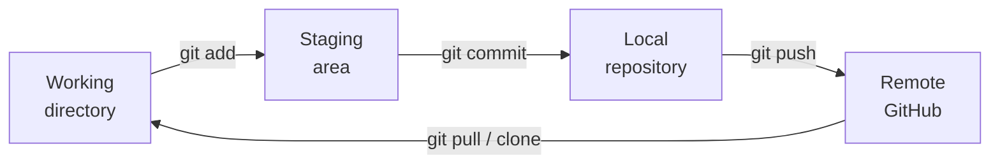

# Git Basics

## Overview

**Git** is a distributed version-control system: it tracks the history of a project as it
changes, lets you undo and compare, and lets multiple people collaborate without stepping on
each other. **GitHub** is a hosting service for Git repositories — the remote your local work
pushes to. This whole textbook lives in a Git repo, and every chapter I fill is a commit. The
concepts below are paraphrased from my STAT 624 Week 1 notes and the general git workflow; I
reproduce no slide or cheat-sheet content.

## The mental model: four places your work lives

The one diagram that makes Git click is the flow of a change from your editor to the server:



- **Working directory** — the files as they currently sit on disk, including edits you haven't
  recorded yet.
- **Staging area (index)** — the set of changes you've marked to go into the *next* commit with
  `git add`. Staging lets you commit some changes and leave others for later.
- **Local repository** — `git commit` snapshots the staged changes into your local history.
  Each commit has a message, an author, a timestamp, and a unique SHA hash you can reference
  later.
- **Remote (GitHub)** — `git push` sends your local commits to the shared server; `git pull`
  brings others' commits down; `git clone` makes a fresh local copy of a remote repo.

## The everyday commands

```bash
git status                 # what's changed, what's staged
git add file.py            # stage one file (git add . stages everything)
git commit -m "message"    # snapshot the staged changes into local history
git push origin main       # send local commits to the remote
git pull                   # fetch and merge others' commits
git log                    # scroll the commit history
```

That's the loop I run dozens of times a day: edit → `status` to see what changed → `add` the
pieces that belong together → `commit` with a message describing *why* → `push` to share.
`git log` (or the repo's commits page on GitHub) is the payoff — the full, timestamped history
of how the project got to where it is.

## Starting a repo, and authentication

- **New repo.** Create one on GitHub (public if you want it shareable, private for confidential
  work), add a `README` describing the project, and a `.gitignore` listing files Git should
  *not* track — virtual environments, large datasets, secrets. (This book's `.gitignore`
  excludes `course-files/`, which is exactly why the raw coursework never gets published.)
- **Licensing.** Without a license, default copyright applies and others can't legally reuse
  your code. If you want a project to be open source, add one deliberately.
- **Authentication.** Pushing to GitHub over HTTPS needs a **personal access token** — a
  credential tied to your machine that stands in for a password. Generate it in GitHub's
  settings and treat it like a secret.

## Cloning vs forking

Two ways to get a copy of someone else's project, and they mean different things:

- **Clone** — `git clone <url>` makes a local copy you can commit to and push back (if you have
  write access). Collaborators on one shared repo all clone it and push to the same remote.
- **Fork** — makes a *copy of the whole repository under your own GitHub account*. You fork when
  you want to build on a project you *don't* have write access to: fork it, clone your fork,
  make changes, push to your fork, then open a **pull request** proposing your changes back to
  the original. This is the standard open-source contribution flow, and it's how the
  [Scientific ML](../12-scientific-ml/index.md) chapter built on an upstream SA-PINN codebase.

## Gotchas

- **Commit messages are for future-you.** "fixed stuff" tells you nothing in three months. Say
  *what* changed and *why* — the commits in this repo read like `feat: fill Python Programming
  chapter from CSE 111 and STAT 624 work`.
- **`.gitignore` before the first commit.** Once a big file or a secret is committed, it's in
  history even after you delete it. Set up `.gitignore` up front so venvs, datasets, and tokens
  never get tracked.
- **Never commit a token or password.** A personal access token pushed to a public repo is
  compromised instantly. Keep secrets out of the working tree entirely.
- **`git push` doesn't push what you didn't commit.** Staging → commit → push is three steps;
  unstaged or uncommitted edits stay on your machine. `git status` before pushing tells you
  what's actually going out.

## References

- STAT 624 Week 1 — Git and GitHub (local:
  `course-files/11-python-programming/Week1_Git.pdf`). Concepts paraphrased in my own words;
  no slide text or figures reproduced.
- GitHub's own Git documentation and its education cheat sheet informed the command list —
  concepts only, no layout or wording reproduced.
