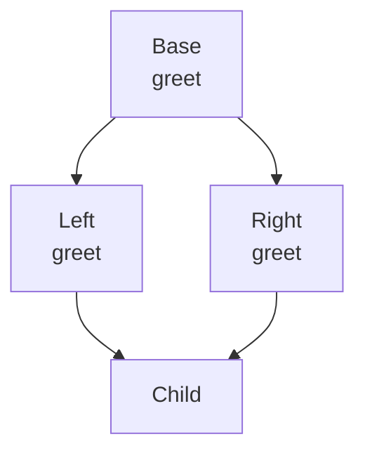

# Inheritance

## Overview

**Inheritance** lets one class build on another: a subclass gets the parent's attributes and
methods for free, then adds or overrides what it needs. It's the "is-a" relationship — a
`FloatEntry` *is an* `Entry`, a `FormulaError` *is a* `ValueError`. STAT 624's Week 10
inheritance lecture covered the taxonomy (single, multiple, multi-level, hybrid), overriding,
`super()`, and the method resolution order; I paraphrase those concepts here with fresh
examples of my own.

## The kinds of inheritance

```python
class Animal:
    def __init__(self, name):
        self.name = name
    def speak(self):
        return "..."

class Dog(Animal):                 # single inheritance: Dog is-a Animal
    def speak(self):               # override: replace the parent's method
        return "Woof"

class Puppy(Dog):                  # multi-level: Puppy -> Dog -> Animal
    def speak(self):
        return super().speak() + " (tiny)"   # extend, don't replace

print(Puppy("Rex").speak())        # -> "Woof (tiny)"
```

- **Single** — one parent (`Dog(Animal)`).
- **Multi-level** — a chain (`Puppy → Dog → Animal`).
- **Multiple** — more than one parent (`class C(A, B)`), which is where things get subtle.
- **Overriding** — a subclass redefines a method name; its version wins for its instances.
- **`super()`** — calls the *parent's* version of a method, so you can extend behavior instead
  of copy-pasting it. `Puppy.speak` reuses `Dog.speak` and just adds to it.

The custom exception from the [classes page](classes-and-oop.md#how-i-did-it-a-custom-exception-class-the-real-thing)
is real inheritance from my own code: `class FormulaError(ValueError)` is a single-inheritance
subclass that adds nothing but a catchable name — the minimal case, and the one I actually
shipped.

## Multiple inheritance, the MRO, and the diamond

Multiple inheritance raises an obvious question: if two parents both define `method()`, which
one runs? Python answers with the **Method Resolution Order (MRO)** — a deterministic linear
ordering of the class and all its ancestors (computed by the C3 algorithm). Attribute lookup
walks that order and takes the first match.

The classic hard case is the **diamond**: two classes both inherit from a common base, and a
fourth inherits from both.



```python
class Base:
    def greet(self): return "Base"

class Left(Base):
    def greet(self): return "Left -> " + super().greet()

class Right(Base):
    def greet(self): return "Right -> " + super().greet()

class Child(Left, Right):
    pass

print(Child().greet())          # Left -> Right -> Base
print([c.__name__ for c in Child.__mro__])
# ['Child', 'Left', 'Right', 'Base', 'object']
```

The MRO is `Child → Left → Right → Base → object`. Two things make this work cleanly: `Base`
is visited **once** (not twice, even though both `Left` and `Right` inherit it), and each
`super().greet()` calls the *next class in the MRO*, not literally "the parent." That's why the
chain reads `Left → Right → Base` — `super()` inside `Left` resolves to `Right`, not to `Base`,
because `Right` is next in `Child`'s MRO. Reading `super()` as "the parent" instead of "the
next in MRO" is the number-one source of multiple-inheritance confusion.

## Gotchas

- **`super()` means "next in the MRO," not "my parent."** In a diamond, `super()` inside a
  class can dispatch to a *sibling* branch, not the class you literally inherited from. Check
  `Cls.__mro__` when the call chain surprises you.
- **Prefer composition when "is-a" is a stretch.** Inheritance couples a subclass tightly to
  its parent's internals. If the relationship is really "has-a" (a `Report` *has a* formatter),
  hold the object as an attribute instead of subclassing.
- **Deep chains hide behavior.** A method three levels up, half-overridden along the way, is
  hard to trace. Keep hierarchies shallow; a single level of subclassing covers most real
  needs (my `FormulaError` is one level and that was plenty).
- **Call `super().__init__()` in subclass constructors.** If you override `__init__` and forget
  to initialize the parent, the parent's attributes never get set — the tkinter
  `super().__init__(master)` on the classes page exists for exactly this reason.

## References

- STAT 624 Week 10 — Class inheritance (local:
  `course-files/11-python-programming/Week10_classesInheritance.ipynb`). Instructor material,
  © 2023 Scott A. Bruce, do-not-distribute; concept summary only, no exercise text reproduced.
